MIT概率导论的学习总结。

## 1 概率模型

### 1.1 样本空间与概率公理

### 1.2 核心法则

- 条件概率

$$
P(A|B)=\frac{P(A)\cap P(B)}{P(B)}
$$

- 乘法法则

$$
P(A\cap B)=P(B)\cdot P(A\mid B)=P(A)\cdot P(B\mid A)
$$

- 链式法则

> 乘法法则推广到N个事件

$$
P(X_1,X_2,…,X_n)=P(X_1)P(X_2|X_1)...P(X_n|X_1,X_2,…,X_{n−1})
$$

- 全概率定理

$$
P(B)=P(A)P(B\mid A)+P(A^c)P(B\mid A^c)
$$

- 贝叶斯法则

$$
P(A_i\mid B)=\frac{P(A_i)P(B\mid A_i)}{P(B)}
$$

- 独立概率

### 1.3 总结

## 2 离散变量

### 2.1 概率质量函数

#### 随机变量

- 分布列（PMF）

  也就是概率质量函数。

####  ==联合分布列==

####  ==随机变量的函数==

> 多个随机变量是指在同一个试验结果之下产生的多个随机变量，它们的样本空间和概率律是相同的。

### 2.3 条件PMF

####  某个事件发生的条件下的随机变量

- 帮助理解的例子

#### 给定另一个随机变量的值的条件下的随机变量

#### 总结

### 2.3 独立

#### 随机变量与事件的独立性

#### 随机变量之间的独立性

### 2.4 常见PMF

#### 二项分布

#### 几何分布

#### 泊松分布

#### 总结

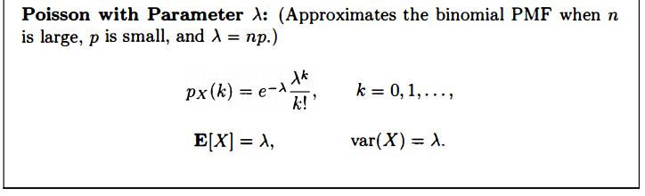

## 3 连续变量

### 3.1 概率密度函数

#### 连续随机变量

- 深入理解连续r.v.

### 3.2 累积分布函数

#### 离散情况

> 跳跃点取右端值

#### 连续情况

- 均匀

- 分段

  

#### 总结

### 3.3 重要分布

#### 指数随机变量的分布

讨论几何随机变量和指数随机变量的关系。

#### 一元正态分布

##### 标准化

#### 总结

### 3.4 ==联合概率密度==

#### 3.4.1 多个随机变量的联合概率密度

### 3.5 条件概率密度

####  3.5.1 以事件为条件

#### 3.5.2 一个随机变量对另一个随机变量的条件

### 3.6 期望

#### 3.6.1 期望与方差

- 离散

$$
E(X)=\sum_x x p_X(x)\\E(Y)=\sum_x g(x) p_X(x)=\sum_y y p_Y(x) \quad (Y=g(X))
$$

- 随机

#### 3.6.2 条件期望

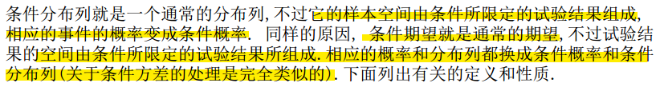

离散

- 随机

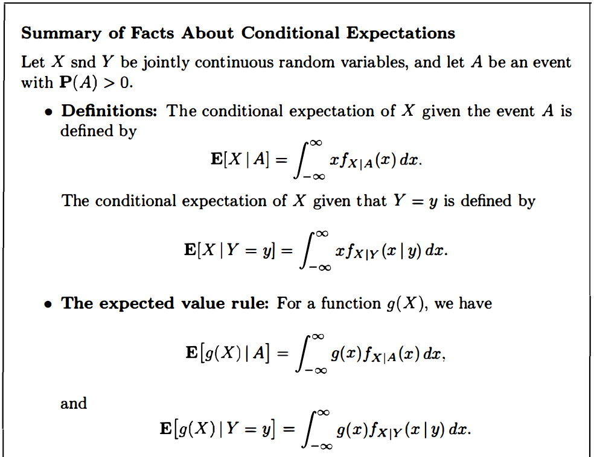

#### 3.6.3 全期望法则

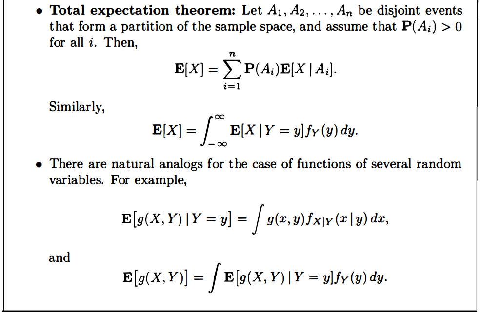

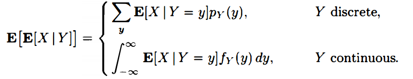

#### 3.6.4 重期望与全方差

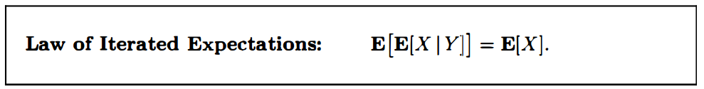

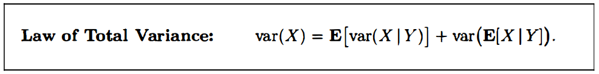

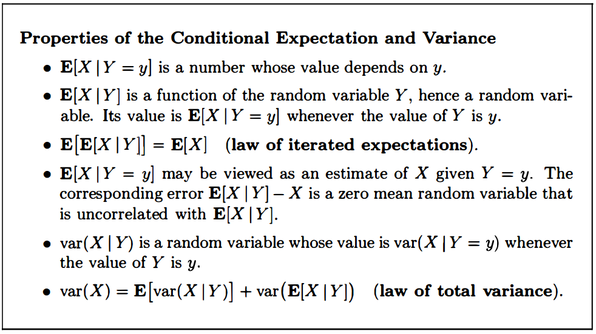

### 3.6 深入内容

####  3.6.1 随机变量函数的PDF

> 指数随机变量/正态随机变量都满足线性

- 单调函数

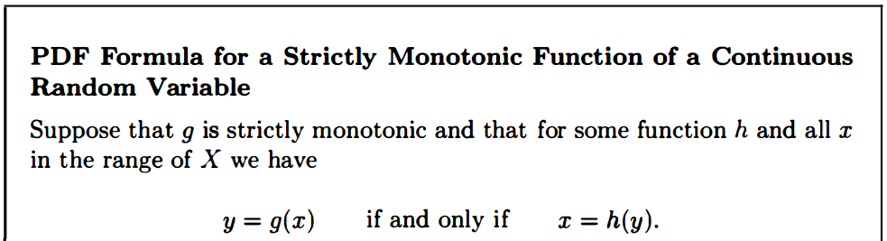

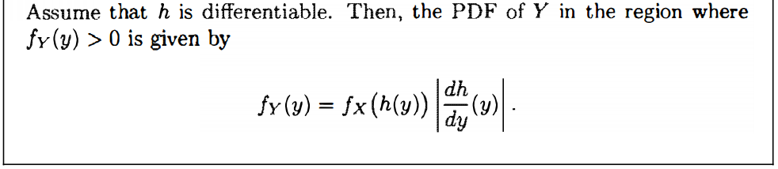

> 证明1

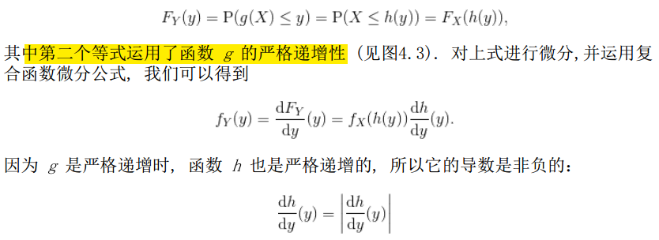

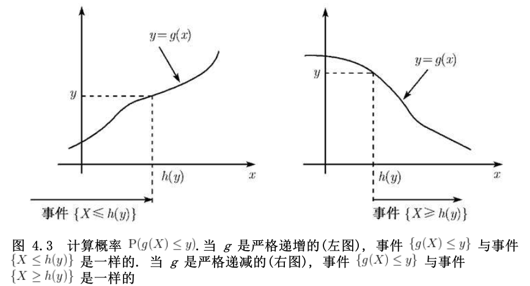

> 证明2

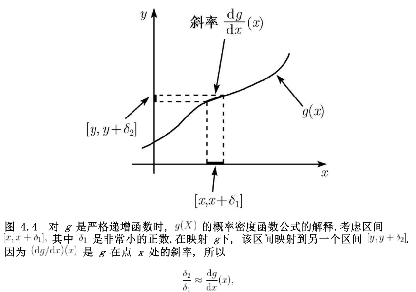

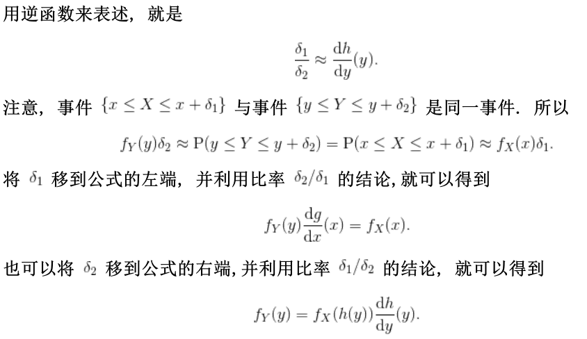

#### 独立随机变量的和-卷积

#### 3.6.2 协方差和相关系数

量化两个随机变量的大小和方向。

相关系数反映了随机变量间的趋向程度的标准度量大小，区间-1到1。

## 4 随机过程

> 包含时间以及数据序列的概率模型

未来数据与过去无关，只与当前有关。

### 3.1 伯努利过程

- 例子

Sequence of lottery wins/losses 

Sequence of ups and downs of the Dow 

 Arrivals (each second) to a bank

 Arrivals (at each time slot) to server

#### 定义

>单位时间到达次数：Binomial
>
>首次到达时间: Geometric

#### 性质

#### 相邻到达间隔时间

> Distribution of interarrival times 

####第k次到达时间

> The time of the kth success

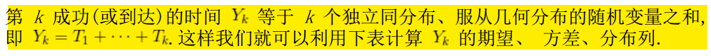

#### 二项分布的伯努利近似

### 3.2 泊松过程

### 定义

#### 区间内到达次数

#### 相邻到达时间

### 3.3 马尔可夫过程

## 5 极限理论

### 4.1 弱大数定理

#### 马尔科夫与切比雪夫不等式

> 从均值考虑，如果均值小，随机变量取大值的概率也小。

证明：

#### 弱大数定理

### 4.2 中心极限定理

### 4.3 强大数定理

#### 依概率收敛

### 强大数定理

##6 贝叶斯统计推断

### 5.0 连续贝叶斯准则

关于离散随机变量的推断

基于离散观察值得推断

### 5.1 后验分布

### 5.2 点估计，假设检验，MAP

点估计：观测到$x$,得到后验分布后，在所有$\theta$中寻找“最优的值”$\hat \theta$，使犯错误的概率最小。

两张选择方法，一个选择最大值，一个选择平均值。

#### (1)最大后验准则MAP

#### (2)条件期望估计量

#### (3)假设检验

### 5.3 最小均方估计

讨论条件期望估计量。具有使可能的LMS达到最小的性质。

估计误差：$\hat \theta - \Theta$ 

均方误差: $E[(\Theta - \hat \theta)^2]$ 

对任何估计$\hat \theta$ ,  
$$
E[(\Theta - \hat \theta)^2]=var(\Theta -\hat \theta)+(E[(\Theta-\hat \theta)])^2=var(\Theta)+(E[\Theta]-\hat \theta)^2
$$

> 由$E[Z^2]=var(Z)+E^2[Z]$ , 且常数$\hat \theta$ 不影响方差。
>
> 又因方差部分与$\hat \theta$ 无关，故$\hat \theta = E[\Theta]$ 取得LMS最小值。 

对于条件期望得到的估计量，同时要求LMS最小。
注意条件期望，就是在一个与x相关的新的概率空间。

同时，另外一种可视为估计量为$g(X)$的非条件LMS为
$$
E[(\Theta - g(X))^2]
$$
而$E[\Theta|X]$ 看做X的函数或者估计量，则$g(X)=E[\Theta|X]$ 使LMS最小。

#### 例子

随机误差$W~U[-1,1]$;  

$X$~$U[\theta-1, \theta+1]$ 

联合概率密度$f_{\Theta, X}(\theta, x)=f_\Theta(\theta)f_{X|\Theta}(x|\theta)=\frac{1}{6}\times\frac{1}{2}$, 当$\theta\in[4,10], x\in [\theta-1, \theta+1]$

#### 估计误差的性质

### 5.4 线性LMS

## 7 经典

### 5.2.1 估计量

### 5.2.1 最大似然估计

对指数分布求最大似然

1. log
2. 求导数
3. 得到最好估计

### 5.2.3 随机变量均值和方差的估计

### 5.2.4 置信区间

$\theta$ 并非随机量，关注的核心对每一个独立的$\theta$ ， 有多少可能性，真实的值落在这个区间。

- 例子

如何计算置信区间

1. 设定$\alpha$
2. 求解标准正态分布对应的$z$
3. 将估计的$\sigma$,  样本均值$\theta$ 以及总数$n$代入
4. 得到上下界

#### 估计方差方法

### 5.2.5 简单假设检验

### 5.2.6 显著性检验

