#基本概念

## 仿射集affine set

直线，$x=\theta x_1+(1-\theta)x_2, \theta \in R$

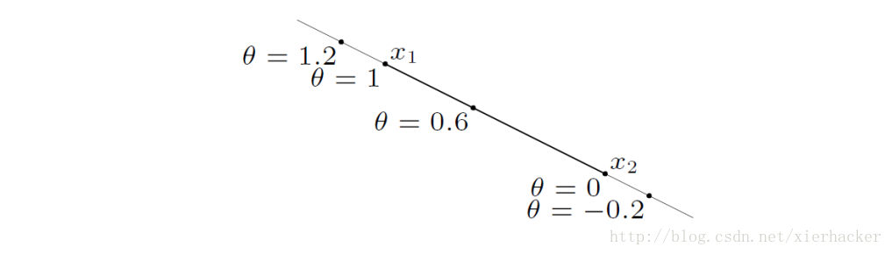

仿射集：contains the line through any two distinct points in the set

例子：线性方程$\{x|Ax=b\}$的解集是仿射集。(相反的，所有仿射集可以表示成线性方程系统的解集 )

## 凸集convex set

线段,  $\theta∈[0,1]$

凸集：contains line segment between any two points in the set
$$
x_1,x_2\in C, x\leq \theta \leq 1 \to \theta x_1+(1-\theta)x_2\in C
$$

## 凸组合，凸包，凸锥

convex combination

$x=\theta_1x_1+…+\theta_kx_k$,   $\theta_1+…\theta_k=1,\theta_i\geq0$

convex hull

> set of all convex combinations of points in convex set S

- convex cone

conic (nonnegative) combination

$x=\theta x_1+\theta x_2, \theta_1,\theta_2\geq0$

凸锥包含所有conic组合  

## 几个特殊的凸集

下面是最常见的几个凸集的例子:

- 超平面(hyperplane)

  $\{x|a^Tx=b\}$, 其中$x, a\in R^n, b\in R, a\neq 0$.

  - a is the normal vector
  - affine and convex 

- 球和椭圆

$B(x_c,r)=\{x|||x-x_c||^2\leq r\} = \{x_c+ru|||u||_2\leq1\} $ 

$\{x|(x-x_c)^TP^{-1}(x-x_c)\leq 1\}$, $P\in S^n_{++}$（对称正定）

or $\{x_c+Au|||u||_2\leq 1\}$  A为方阵非奇异

- 多面体

  > 有限个半空间的非空交集
  >
  > $P=\{ x|a_j^Tx\leq b_j,c_i^Tx=d_i\}$，其中$j=1,…,m,, i=1,…,r$
  >
  > 仿射集(如超平面，直线)，射线，线段，半空间都是多面体

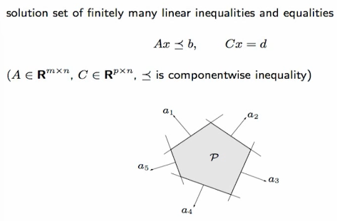

## 保持凸性的运算

- 集合交运算

- 仿射变换

  > （1）$f(x)=Ax+b, A\in R^{m \times n},b\in R_m$
  >
  > （2）若f仿射变换，$f:R^n\rightarrow R^m, f(S)=\{f(x)|x\in S\}$，
  >
  > 则S凸，f(S)凸。反之亦然。

  伸缩，平移，投影

  

- 透视变换

  > 对向量进行伸缩(规范化)，将最后一维分量为1
  >
  > $ P:R^{n+1}\rightarrow R^n, P(z,t)=z/t$, 其中$z\in R^n, t\in R$ 
  >
  > 如小孔成像。

- 投射变换

  > 仿射与透视的复合。也叫线性分式函数

  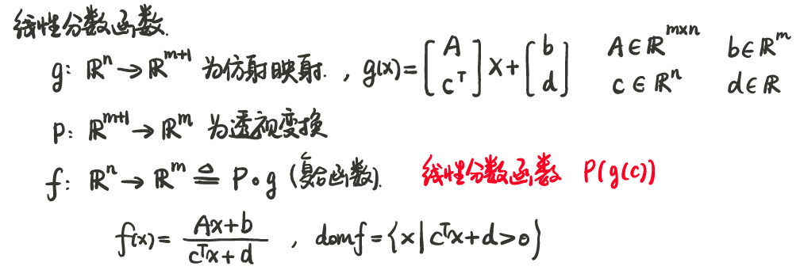

## 分割超平面

C，D为不相交的凸集，则存在超平面P，可以将C，D分离

$\forall x\in C, a^Tx\leq b$, 且$\forall x\in D, a^Tx\geq b$

- 支撑超平面

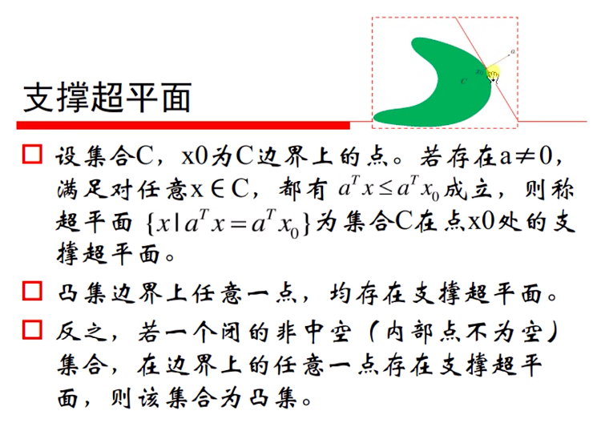

# 凸函数

## 四个定义

1. $f:R^n\to R$为凸，  $\iff$ 

   (1)定义域$domf$为凸集, 

   (2)$∀x,y∈domf,∀\theta∈[0,1]$,  
   $$
   f(\theta x+(1−\theta)x)≤\theta f(x)+(1−\theta)f(y)
   $$

   > 即两点割线位于函数上方

2. (高纬情况)$f:R^n\to R$为凸，  $\iff$

    (1)定义域$domf$为凸集

    (2)$∀x∈domf,∀\text{方向向量}v$,   $g(t)=f(x+tv)$为凸函数，$dom \text{ }g=\{t|x+tv\in domf\}$

   > 也就是将高维f空间，降到1维g空间

3. ==一阶条件==

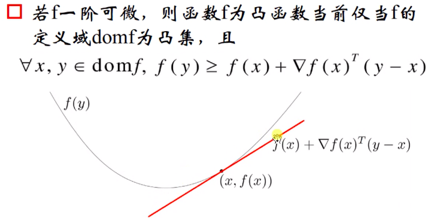

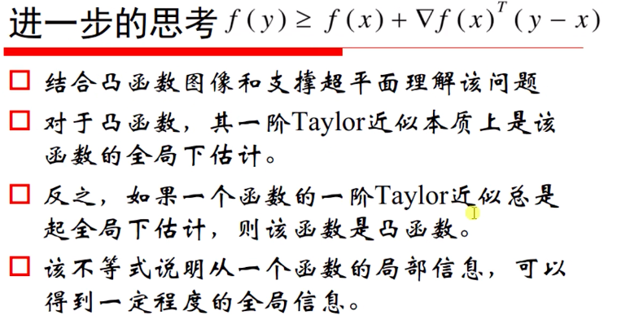

**==4 .二阶条件==**

一阶条件不方便实际应用，需要对每一点验证。

由泰勒系数，
$$
f(x_1)=f(x)+\nabla^Tf(x)(x_1-x)+(x_1-x)^TH(x)(x_1-x)+O^3(x)  \iff \\
f(x_1)-f(x)-\nabla^Tf(x)(x_1-x)=(x_1-x)^TH(x)(x_1-x)
$$
则，一阶条件成立，等价于Hessian矩阵正定。

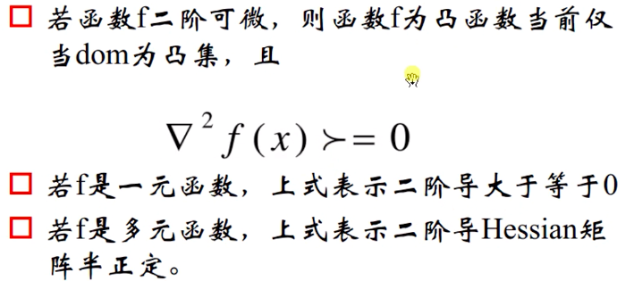

### 例子

- 凸函数

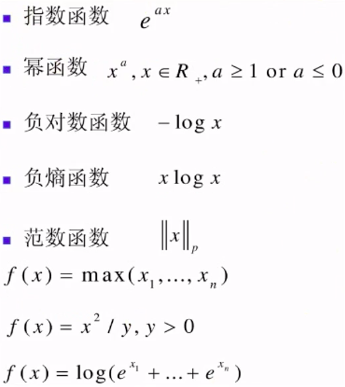

- 非凸函数

几何平均：$f(x)=(x_1\cdot …\cdot x_n)^{1/n}$

行列式对数：$log det(x), domf=S_{++}^n$

### 下水平集以及上镜图

- α-sublevel set

The ==α-sublevel set== of a function $f : R^n → R$ is defined as
$$
C_α = \{x ∈ domf | f(x) ≤ α\}
$$

> 对于任意$\alpha$值，凸函数的下水平集是凸集

- epigraph

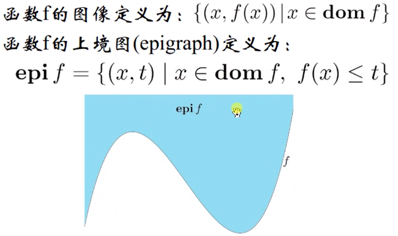

> 一个函数是凸函数，当且仅当上镜图为凸集

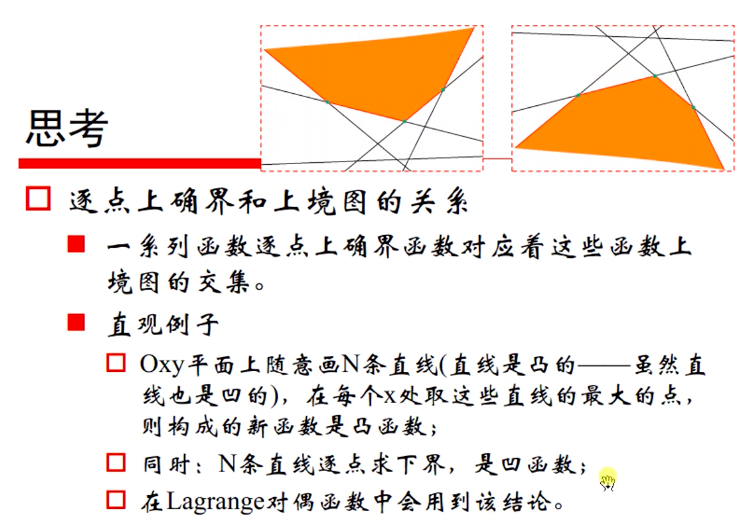

### Jensen不等式

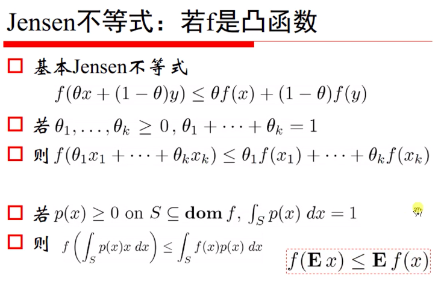

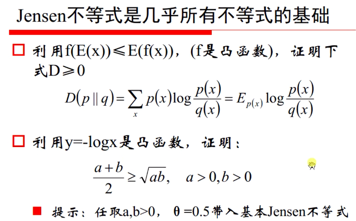

## 

## 保凸运算

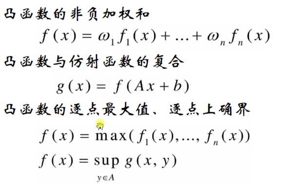

## 拟凸函数

- 定义

> quasiconvex (or unimodal )

1. $S_α = \{x ∈ domf | f(x) ≤ α\}$

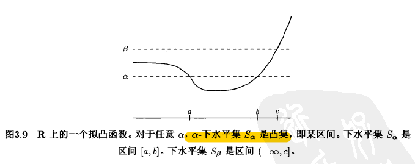

2. 

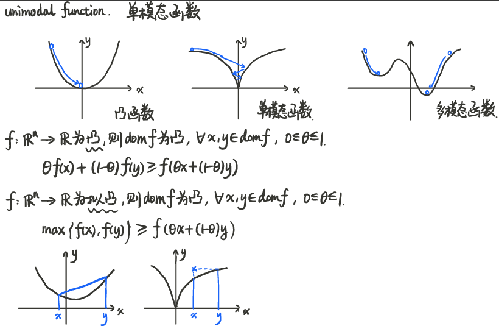

### 性质

- 可微拟凸函数一阶条件

domf凸 且 $f(y) ≤ f(x) ⇒ ∇f(x)T (y − x) ≤ 0$

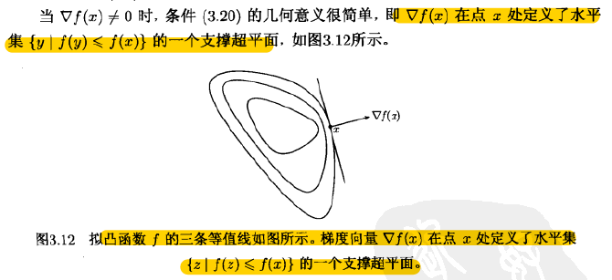

- 可微拟凸函数二阶条件

domf为凸 且 $y^T∇f(x) = 0 ⇒ y^T∇^2f(x)y ≥ 0$

## 共轭函数

