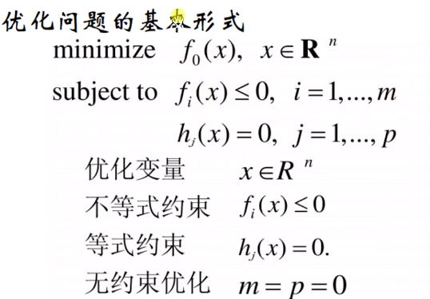

# 凸优化问题

## 优化问题

## 凸优化

- locally optimal

 x is feasible
$$
f_0(x) = inf \ \{f_0(z) | \text{z is feasible}, ||z − x||_2 ≤ R\}
$$

### 最优性条件

对于可微凸问题，存在 $x, y ∈ dom \ f_0$
$$
f_0(y) ≥ f_0(x) + ∇f_0(x)^T (y − x)
$$
 x is optimal if and only if it is feasible and 
$$
∇ f_0 ( x ) ^T ( y − x ) ≥ 0 \ \text{for all feasible y}
$$

> 互补条件： $\nabla f_0(x)$ 与$x$每一个分量至少一个为0

### 拟凸优化

- 拟凸问题

$$
\text{minimize}\text{ } f_0(x)\\
\text{subject to}\text{ } f_i(x)\leq0, i=1,...,m\\
\text{}     Ax = b
$$

$\text{with}\  f_0 : R n → R \ \text{quasiconvex},\  f_1, . . . , f_m \ convex$

- convex representation of sublevel sets of $f_0$:

$$
f_0(x) ≤ t \iff φ_t(x) ≤ 0
$$

- quasiconvex optimization via convex feasibility problems

$$
\text{find}\ x\\
\text{subject to}\ \ φ_t(x) ≤ 0\\
\quad \quad\quad \quad \quad f_i(x) ≤ 0, i = 1, . . . ,m\\
Ax = b
$$

## 线性优化

Linear program

> When the objective and constraint functions are all affine, the problem is called a linear program

$$
\text{minimize}\text{ } c^Tx + d \\
\text{subject to}\text{ } Gx <= h\\
Ax = b
$$

### Linear-fractional program

$f_0(x) =\frac{c^Tx + d}{e^T x + f}, \quad dom\ f_0 = \{x | e^Tx + f > 0\}$
$$
\text{minimize}\ f_0(x)\\
\text{subject to}\ Gx \preceq h\\
Ax = b\\
$$

- Transforming to a linear program

$$
\text{minimize} \ c^T y + dz\\
\text{subject to}\ Gy − hz \preceq 0\\
Ay − bz = 0\\
eT y + fz = 1\\
z ≥ 0
$$

# 对偶

## 对偶函数

在目标问题中，添加约束条件的加权和，得到增广的无约束的目标函数。

从Lagrange函数引入Lagrange对偶函数，再引入Lagrange对偶问题。

- Lagrange函数

> $L:R^n\times R^m \times R^p \to R$ 

> ⚠️原问题和Lagrange函数的定义域区别。

- Lagrange对偶函数

- Lagrange对偶问题

Lagrange对偶函数给出了优化问题最优值$p^*$的一个下届。自然要问，Lagrange函数中能得到的最好下界是什么？这个问题就是对偶问题：
$$
\text{maximize}\ g(λ, ν)\\
\text{subject to}\ λ \succeq 0
$$

> 一定为凸问题。由于目标函数为凹函数，且约束集合为凸集。
>
> 最优值$d^*$

## 性质

（1）最优值$d^* \leq p^*$  （弱对偶性）

> 最有对偶间隙：$p^* -d^*$

（2）$d^* = p^*$ (强对偶性)

### 与共轭函数联系

conjugate $f^∗$ of a function $f : R^n → R$ is given by
$$
f^∗(y) = \sup_{x\in dom f}(y^Tx-f(x)) 
$$
对于一般的优化问题
$$
\text{minimize}\text{ } f_0(x)\\
\text{subject to}\text{ } Ax \preceq b \\
\text{}     Cx = d
$$
其对偶函数可表述为
$$
g(λ, ν) = = −b^T λ − d^T ν − f^∗_0 (−A^T λ − C^T ν)
$$
定义域$dom\ g = \{(λ, ν) | − A^T λ − C^T ν ∈ dom\ f^∗_0\}$

## Slater条件

> 满足$d^* = p^*$ (强对偶性)的充要条件。

如果对于凸问题，
$$
\text{minimize} \ \ \  \ \ \ \ \  \ \ f_0(x)\\
\text{subject to}\ \ \ \ \ \ \  \ f_i(x) ≤ 0, i = 1, . . . ,m\\
Ax = b,
$$
其中$f_i$为凸，存在$x ∈ relintD$ (相对内部，即把边界去掉的开集)
$$
f_i(x) < 0, i = 1, . . . ,m\\Ax = b
$$
如果不等式约束为仿射，则存在$x ∈ relintD$ 
$$
f_i(x) ≤ 0, i = 1, . . . , k, \\ f_i(x) < 0, i = k + 1, . . . ,m,\\ Ax = b.
$$

### 四种解释

- 几何
- 鞍点
- 多目标优化
- 经济

### 鞍点定理

若$(\tilde x, \tilde λ)$ 为$L(\tilde x, \tilde λ)$的鞍点，$\iff$  强对偶存在，且$\tilde x, \tilde λ$为primal， dual问题的最优解。

## KKT条件

> 假设（1）$d^* = p^*$ ;  (2)所有函数可微

> 若为一般的可微优化问题，则KKT条件为必要条件。
>
> 若原问题为凸问题，各个函数可微，对偶间隙为0，则KKT条件为充要条件。

# 另外一种理解思路

# 拉格朗日

Lagrange multipliers

> 1. each individual Lagrange multiplier can be interpreted as the ==rate of change== in the objective function with respect to changes in the associated constraint function . 
>
> 2. In simple terms, if $x^∗$ is a local minimizer of a constrained minimization problem, then in addition to $x^∗$ being a feasible point, the gradient of the objective function at $x^∗$ has to be a linear combination of the gradients of the constraint functions, and the Lagrange multipliers are the ==coefficients in that linear combination.==
>
> 3. the Lagrange multipliers associated with inequality constraints have to be ==nonnegative== and the multipliers associated with inactive inequality constraints have to be ==zero==.

## 等式约束

$$
minimize \quad f(x)\\
subject\ to \quad a_i(\bold x)=0\quad for\ i=1,2,...,p
$$

极值点条件

$$
Tx∗ = \{x | ∇f(x^∗)T(x − x^∗) = 0\}
$$

$$
T_{x^∗} = \{x | J_e(x^∗)(x − x^∗) = 0\}
$$

$$
N_{x^∗} = \{x | x − x^∗ = \sum^p_{i=1}
α_i∇a_i(x^∗)\ for\ α_i ∈ R\}
$$

> $\{N_{x^∗} − x^∗\}$ is the range of matrix $J^T_e (x^∗)$, and hence it is a
> p-dimensional subspace in $R^n$. More importantly, $T_{x^∗}$ and $N_{x^∗}$ are orthogonal to each other

### 一阶必要条件(KKT)

The necessary conditions for a point x∗ to be a local minimizer are useful in two situations:

 (a) They can be used to exclude those points that do not satisfy at least one of the necessary conditions from the candidate points;

 (b) they become sufficient conditions when the objective function in question is convex 

(1) $a_i(x^∗) = 0\quad for\ i = 1, 2, . . . , p$

(2)
$$
∇f(x^∗) =\sum^p_{i=1}λ^∗_i∇a_i(x^∗) \\
\boldsymbol{g}(\bold x^∗) − \boldsymbol{J}^T_e (\bold x^∗)\boldsymbol{\lambda}^∗ = 0 \quad \text{(vector form)}
$$
then there exists a vector$ \boldsymbol{\lambda}^∗ ∈ R^p$ such that the `(n + p)-
dimensional` vector $[\bold x^{∗T} \boldsymbol{\lambda}^{∗T}]^T$ satisfies the n + p nonlinear equations

## 不等式约束

## 一般约束问题

$$
\text{minimize} \ \ \  \ \ \ \ \  \ \ f(\bold x)\\
\text{subject to}\ \ \ \ \ \ \  \ a_i(\bold x) = 0, i = 1, . . . ,p\\
 \quad  \quad \quad \quad \quad \quad \  c_j(\bold x) \geq 0, , i = 1, . . . ,q\
$$

拉格朗日函数：
$$
L(\boldsymbol{x}, \boldsymbol{\lambda}, \boldsymbol{\mu}) = f(\boldsymbol{x})-\sum^p_{i=1}\lambda_ia_i(\boldsymbol{x}) - \sum^q_{j=1}\mu_jc_i(\boldsymbol{x})
$$
KKT条件

> first-order necessary conditions for point x* to be a minimum point

If $x^*$ is a local minimizer of the constrained problem, then
(1) $a_i(x^*) = 0, i = 1, . . . ,p$

(2) $c_j(x^*) \geq 0, , i = 1, . . . ,q$

(3)there exist Lagrange multipliers $λ^*_i$  for $1\leq i \leq p$ and $\mu^*_j$ for $1 ≤ i \leq q$  such that
$$
\nabla f(\boldsymbol{x}^*)=\sum^p_{i=1}\lambda_i^*\nabla a_i(\boldsymbol{x}^*) +\sum^q_{j=1}\mu_j^*\nabla c_i(\boldsymbol{x}^*)
$$
(4) $\mu^*_jc_j(\boldsymbol{x}^*)=0\quad \text{for} \ j=1,2…,q$

(5) $\mu^*_j\geq0 \quad \text{for} \ j=1,2…,q$

> ⚠️说明：
>
> - (3) says at a local minimizer, the gradient of the objective function is a linear combination of the gradient of the constraint functions, and the coefficients of the combination are Lagrange multipliers. See Example 10.10 and Fig. 10.8 for illustration.
>
> - 3式也可以表达成$\nabla_{x}L(\boldsymbol{x}^*, \boldsymbol{\lambda}, \boldsymbol{\mu})=0$; 
>
> - 等式和不等式约束可以表达成，$\nabla_{\lambda}L(\boldsymbol{x}^*, \boldsymbol{\lambda}, \boldsymbol{\mu})=0$， $\nabla_{\mu}L(\boldsymbol{x}^*, \boldsymbol{\lambda}, \boldsymbol{\mu})\geq 0$
>
> - 4式互补松弛条件
>
> It follows that if the kth inequality constraint is in active at $x^*$, then $μ_k =0$ . 
>
> In other words, the equation in (3) only contains those terms $∇c_j (\boldsymbol{x}^∗)$ that are active at$ x_*$.
>
> (active表示正好x处于约束的边界位置)
>
> - The total number of equations p (from (1)) + n (from (2)) + q (from (4)) are equal to the total number of unknowns$\{\boldsymbol{x}^*, \boldsymbol{\lambda}^*, \boldsymbol{\mu}^*\}$

### 例子

Wolfe Duality 