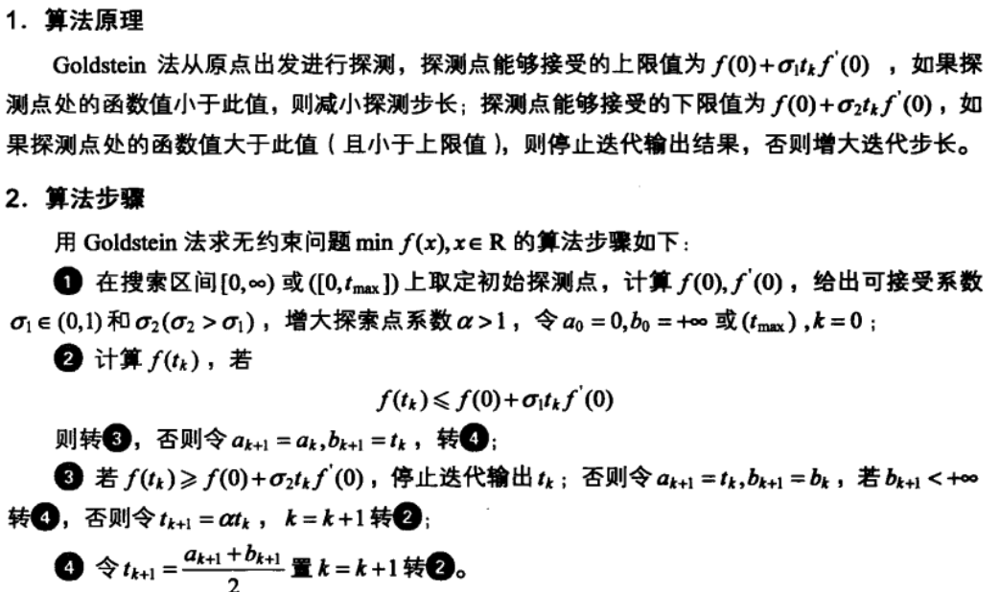
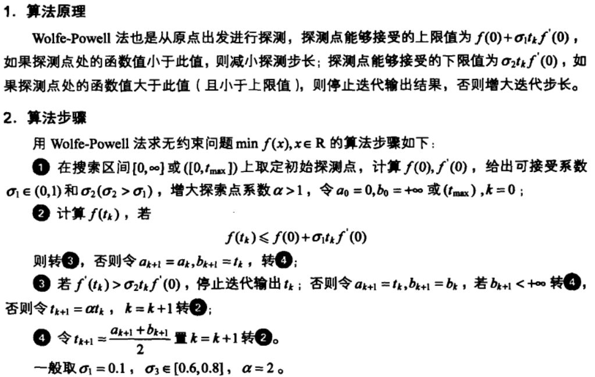
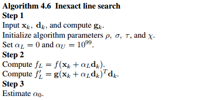
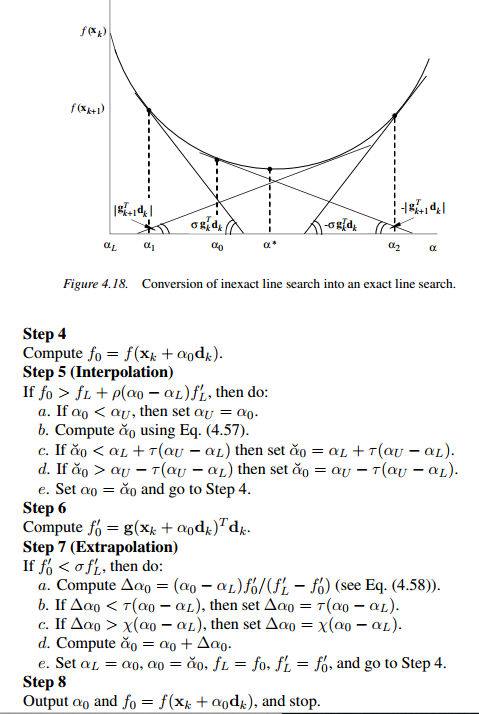

精通MATLAB最优化计算


求解无约束一维求极值问题

- 线搜
- 非线搜

抛物线法

三次插值法

[最优化算法(2):线搜索](https://www.longzf.com/optimization/2/line_search/)

# 精确法

## 进退法

> 确定搜索区间(包含极小值)

```matlab
%code
function [minx,maxx] = minJT(f,x0,h0,eps)
%输入：
%   初始点： x0; 初始步长：h0; 精度：eps
%输出：
%   包含极值的区间的左右端点：minx，maxx
format long;
if nargin == 3
    eps = 1.0e-6;
end

startx = x0;
iters = 0;
stepLen = h0;
while 1
    searchx = startx + stepLen;
    iters = iters+1;
    f_searchx = subs(f, symvar(f),searchx);
    f_leftx = subs(f, symvar(f),startx);
    if f_searchx < f_leftx
        x2 = startx
        startx = searchx;
        f2 = f_leftx;
        f_leftx = f_searchx;
        stepLen = 2*stepLen;
    else
        if iters==1
            stepLen = -stepLen;
            x2 = searchx;
            f2 = f_searchx;
        else
            x3 = x2
            x2 = startx;
            startx = searchx;
            break;
        end
    end
end

minx = min(startx,x3);
maxx = startx+x3 - minx;
format short;


%test
>> syms t;
>> f = t^4 - t^2 - 2*t + 5;
>> [x1, x2] = minJT(f,0,0.1)
x1 =
    0.3000
x2 =
    1.5000
```


## 黄金分割法

```matlab
function [x,minf] = minHJ(f,a,b,eps)
%输入：
%   a，b:极值区间左右端点; eps:精度
%输出：
%   x: 自变量取值； minf：最小值

format long;
if nargin == 3
    eps = 1.0e-6;
end

golden_left = a + 0.382*(b-a);
golden_right = a + 0.618*(b-a);
iters=1;
length = b-a;

while length>eps && iters<10000
    f_golden_left = subs(f , symvar(f), golden_left);
    f_golden_right = subs(f , symvar(f), golden_right);
    if f_golden_left > f_golden_right
        a = golden_left;
        golden_left = golden_right;
        golden_right = a + 0.618*(b - a);
    else
        b = golden_right;
        golden_right = golden_left;
        golden_left = a + 0.382*(b-a);
    end
    iters = iters+1;
    length = abs(b - a);
end

if iters == 10000
    disp('cannot find minimal');
    x = NaN;
    minf = NaN;
    return;
end

x = (a+b)/2;
minf = double(subs(f, symvar(f),x));
format short;
```

# 非精确

## inexact

实际计算中，通常采用非精确线搜索技术，这是因为精确线搜索技术耗费大量的计算资源，而且对于多变量函数的优化，许多算法的收敛速度并不取决于是否采用精确线搜索技术。

[用“人话”解释不精确线搜索中的Armijo-Goldstein准则及Wolfe-Powell准则](https://www.codelast.com/原创用人话解释不精确线搜索中的armijo-goldstein准则及wo/)


我们将非精确线搜索技术常用的四个准则的含义总结如下：

- Armijo-Goldstein 准则

  > $f(x_k+\alpha_kd_k) \leq f(x_k) + ραg_k^Td_k$
  >
  > $f(x_k+\alpha_kd_k) \geq f(x_k) + (1-ρ)αg_k^Td_k$
  >
  > 条件一保证目标函数在下降方向下降且搜索步长不太大；条件二保证搜索步长不太小。

- Wolfe-Powell 准则：条件一保证目标函数在下降方向下降且搜索步长不太大；条件二保证目标函数极小值点有成为搜索步长的可能且搜索步长不太小。

- 强 Wolfe-Powell 准则：条件一保证目标函数在下降方向下降且搜索步长不太大；条件二保证目标函数极小值点有成为搜索步长的可能、极限情况下导致精确线搜索的可能且搜索步长不太小。

- 简单准则：保证目标函数在下降方向下降且搜索步长不太大。

### 算法

- 简化版



> 一般$\sigma_1\in (0,0.5],\ \sigma_2\in (0.5,1], \ \alpha=2$

```matlab
function [x,minf] = minGS(f,XMAX,sigma1,sigma2,alpha,eps)
% Armijo-Goldstein

%输入：XMAX

format long;
if nargin == 5
    eps = 1.0e-6;
end

if sigma1<=0 || sigma1>1
    disp('sigma1参数不对！');
    x = NaN;
    minf = NaN;
    return;
else
    if sigma2 <= sigma1
        disp('sigma2参数不对！');
        x = NaN;
        minf = NaN;
        return;
    else
        if alpha <= 1
            disp('alpha参数不对！');
            x = NaN;
            minf = NaN;
            return;
        end
    end
end

    
df = diff(f);
f0 = subs(f, symvar(f),0);
df0 = subs(df, symvar(df),0);

left_alpha = 0;
right_alpha = XMAX;
iters = 0;
search_value = (left_alpha+right_alpha)/2;

while 1
    f_search_value = subs(f,symvar(f),search_value); %探索点函数值
    f_max = f0 + sigma1*search_value*df0;  %可接受函数值上限
    if f_search_value <= f_max
        f_min = f0 + sigma2*search_value*df0; %可接受函数值下限
        if f_search_value >= f_min
            x = search_value;
            break;
        else
            left_alpha = search_value;   %更新
            if right_alpha < XMAX
                search_value = (left_alpha+right_alpha)/2; %更新
            else
                search_value = alpha*search_value;
            end
        end
    else
        right_alpha = search_value; %更新
        search_value = (left_alpha+right_alpha)/2;
    end
    iters = iters+1;
end

minf =  subs(f,symvar(f),x);
format short;


```










# Matlab工具箱

fminbnd

```matlab
>> [x,fval,exitflag,output] = fminbnd('x^4-x^2+x-1',-2,1)
x =
   -0.8846

fval =
   -2.0548

exitflag =
     1

output = 

  struct with fields:

    iterations: 11
     funcCount: 12
     algorithm: 'golden section search, parabolic interpolation'
       message: 'Optimization terminated:↵ the current x satisfies the termination criteria using OPTIONS.TolX of 1.000000e-04 ↵'

```

maple

> 求解含参变量最小值 