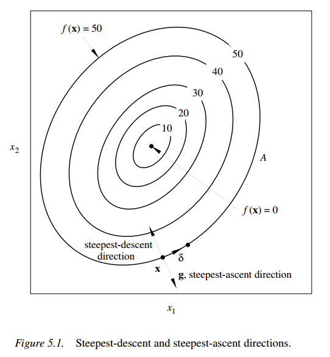
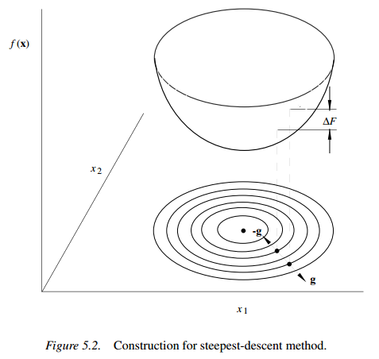
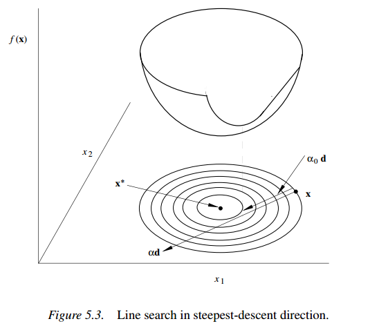
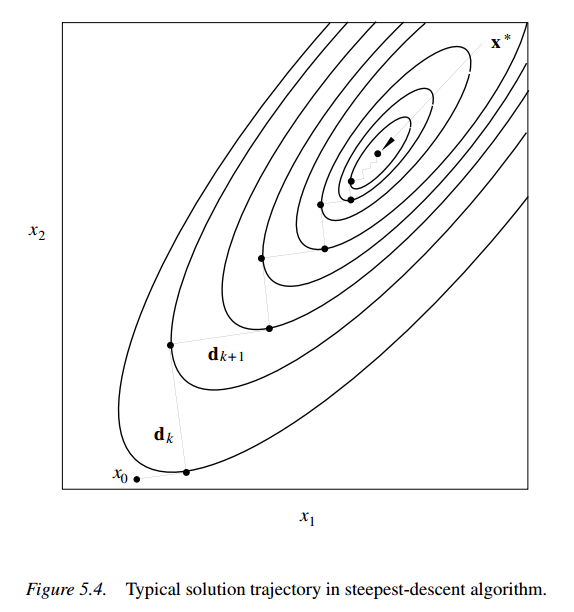
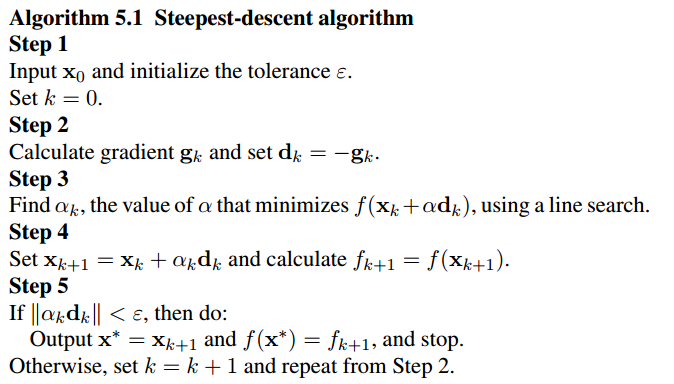
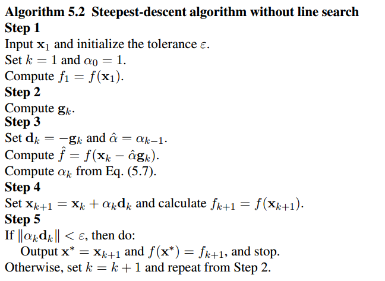

讨论多元无约束优化问题

# 解方程转化为优化问题

$$
n\left\{ \begin{aligned}& {{P}_{1}}(x)=0 \\ & {{P}_{2}}(x)=0 \\ & \text{   }\vdots  \\& {{P}_{n}}(x)=0 \\\end{aligned} \right.\text{              }x=\left[ \begin{aligned}  & {{x}_{1}} \\& {{x}_{2}} \\& \vdots  \\& {{x}_{n}} \\\end{aligned} \right]\text{    (n个自变量}\text{)}
$$
这个方程组里面的每一个函数$P_i(x)$都是光滑 (一般指至少存在一阶和二阶导数)的，其函数可能是线性的，也可能是非线性的。

把上述解方程的问题转化为，优化问题：
$$
\text{ }x=\left[ \begin{aligned}& {{x}_{1}} \\& {{x}_{2}} \\& \vdots  \\& {{x}_{n}} \\\end{aligned} \right]\text{           }\left\{ \begin{aligned}& {{P}_{1}}(x)=0\text{    }\leftrightarrow  \\& {{P}_{2}}(x)=0\text{    }\leftrightarrow \text{ } \\& \text{   }\vdots  \\& {{P}_{n}}(x)=0\text{}\leftrightarrow  \\\end{aligned} \right.\left. \begin{aligned}& {{P}_{1}}^{2}(x)=0 \\& {{P}_{2}}^{2}(x)=0 \\& \vdots  \\& {{P}_{n}}^{2}(x)=0 \\\end{aligned} \right\}\text{ }\leftrightarrow \sum\limits_{i=1}^{n}{{{P}_{i}}^{2}(x)=0}
$$
这解法的好处：

- 即便方程没有解，也可以通过$\operatorname{minimize}\text{  }f(x)=\sum\limits_{i=1}^{n}{{{P}_{i}}^{2}(x)}$求得近似解；
- 在这里不要求方程组里面的函数$P_i(x)$是多项式，可以是三角函数、指数函数等；
- 当方程组里面某个方程$P_i(x)=0$比较重要时，可以通过加权值$w_i$：(局部加权回归)

$$
\operatorname{minimize}\text{  }f(x)=\sum\limits_{i=1}^{n}{{{w}_{i}}{{P}_{i}}^{2}(x)}\text{         }{{\text{w}}_{i}}>0
$$

- 可以通过调整权值系数，让误差平分到每个方程上面。

# 基本优化问题通用解法

$$
\operatorname{minimize}\text{  }f(x) \text{ }\text{  for } x\in R^n
$$

解决无约束优化问题的一般步骤为：

1. 选择初始点$\bold{x}_0$，设置一个收敛误差(convergence tolerance)$\epsilon$, 迭代次数k为0
2. 找到点$\bold{x}_k$处使函数𝑓(𝑥)下降最快的==搜索方向==$\bold{d}_k$
3. 决定==步长==$\alpha_k >0$，减少 $f(\bold{x}_k+\alpha \bold{d}_k)$，且$\bold{x}_{k+1}= \bold{x}+\alpha_k\bold{d}_k$

4. 如果$||\alpha_k\bold{d}_k||<\epsilon$,停止且输出解$\bold{x}_{k+1}$; 否则$k:=k+1$, 重复2.

> **注意**：Step2和Step3是优化问题的关键；Step3是一个元优化的问题，通常被称为线性搜索；其中**𝐱**是一个有n个元素的列向量；假设𝑓(𝑥)二阶连续可微(比较光滑)；

## 一元线性搜索

通过Step2确定下降方向$𝐝_𝑘$之后，$𝑓(𝐱_𝑘+𝛼_𝑘𝐝_𝑘)$可以看成$𝛼_𝑘$的一维函数,寻找步长
$$
F(\alpha)=𝑓(𝐱_𝑘+𝛼_𝑘𝐝_𝑘)
$$

> 也将$F(\alpha)=F(x)$进行替换.
>
> 陆书中第四章介绍了各种寻找步长的方法。
>
> 主要方法有(Dichotomous search, Fibonacci search, Goldensection search, quadratic interpolation method, and cubic interpolation method)；

# 多元无约束优化

各类算法，像最速下降法、牛顿法、拟牛顿法，这些方法的目的就是在找方向$\bold{d}_k$。

## 最速下降法

### 原理

由泰勒公式，
$$
f({{\mathbf{x}}_{k}}+\mathbf{\delta })\approx f({{\mathbf{x}}_{k}})+{{\nabla }^{T}}f({{\mathbf{x}}_{k}})\cdot \mathbf{\delta }
$$
要使新找到的一点$𝐱_𝑘+𝛿$的函数值小于原来点$𝐱_𝑘$的函数值，即：
$$
f({{\mathbf{x}}_{k}}+\mathbf{\delta })-f({{\mathbf{x}}_{k}})={{\nabla }^{T}}f({{\mathbf{x}}_{k}})\cdot \mathbf{\delta }=\left\| \nabla f({{\mathbf{x}}_{k}}) \right\|\cdot \left\| \mathbf{\delta } \right\|\cos \theta <0
$$
其中𝜃为梯度向量$∇f(𝐱_𝑘)$和方向向量δ的夹角，由上式可见当$𝜃=𝜋$时$𝑓(𝐱_𝑘+𝛿)$与$𝑓(𝐱_k)$的差值在满足上式的情况下达到最大，即δ应取与梯度向量相反的方向$−∇𝑓(𝐱_𝑘)$。

故此时使函数$𝑓(𝐱)$在点$𝐱_𝑘$下降速度最快的方向为：
$$
\delta = {{d}_{k}}=-\nabla f({{\mathbf{x}}_{k}})
$$

并且,梯度轨迹总是正交的：
$$
\frac{df(\bold x_k + α\bold d_k)}{dα} = \bold g(\bold x_k + α\bold d_k)^T\bold d_k
$$
当最优$\alpha^*$确定后，
$$
\bold d^T_{k+1}\bold d_k = 0 \Rightarrow \bold d_{k+1} = −\bold g(\bold x_k + α^∗\bold d_k)
$$

### 算法

由泰勒展开二阶项，得到$\alpha_k$的近似解：
$$
α_k ≈ \frac{\bold g_k^T\bold g_k\hat α^2}{2(\hat f− f_k + \hat α\bold g_k^T\bold g_k)}
$$

## 牛顿法(Newton method)

$$
f({{\mathbf{x}}_{k}}+\mathbf{\delta })\text{ }\approx \text{ }f({{\mathbf{x}}_{k}})+{{\nabla }^{T}}f({{\mathbf{x}}_{k}})\cdot \mathbf{\delta }+\frac{1}{2}{{\mathbf{\delta }}^{T}}\cdot {{\nabla }^{2}}f({{\mathbf{x}}_{k}})\cdot \mathbf{\delta }
$$

在$𝐱_𝑘$定了的情况下，$𝑓(𝐱_𝑘+𝛿)$可以看成是$δ$的函数，要使函数达到极小值点，即找出使得函数$𝑓(𝐱_𝑘+𝛿)$对$𝛿$的一阶导数等于0，则有：
$$
\begin{aligned}& f({{\mathbf{x}}_{k}}+\mathbf{\delta }{)}'\text{ }=\nabla f({{\mathbf{x}}_{k}})+{{\nabla }^{2}}f({{\mathbf{x}}_{k}})\cdot \mathbf{\delta } \\& \text{                 =}\nabla f({{\mathbf{x}}_{k}})+H({{\mathbf{x}}_{k}})\cdot \mathbf{\delta }=0 \\\end{aligned}
$$
则下降方向可写为：
$$
\mathbf{\delta }=-{{H}^{-1}}({{\mathbf{x}}_{k}})\cdot \nabla f({{\mathbf{x}}_{k}})
$$

### 与最速下降法比较

(听课的时候就一直在想，一阶导数等于零的点就是极小值点吗？$y=ax2+bx+c$一种简单的一元二次函数的一阶导数等于0的点，是不是极小值点，还的看𝑎的正负呢！)

从上图中可以看出，在点$𝐱_𝑘$处使函数下降最快的方向是$−∇𝑓(𝐱_𝑘)$方向，但它却不是使$𝑓(𝐱_𝑘)$最快接近最小值的方向(最快接近最小值方向应该是上图中红色虚线的方向)；

由此见牛顿法的下降方向：$𝛿=−𝐻^{−1}(𝐱_𝑘)⋅∇𝑓(𝐱_𝑘)$，就是在$−I\cdot∇𝑓(𝐱_𝑘)$乘$𝐻^{−1}(𝐱_𝑘)$.

但是计算量却大大增加。

### 改进

> 由于牛顿法不一定梯度下降，需要进行改进。直观来说，看与最速下降法方向的内积(也就是夹角）进行比较，如果小于90，则是好的方向；如果超过90，则不好。

我们希望的是在乘上$𝐻^{−1}(𝐱_𝑘)$后使得下降方向朝向上图中红色虚线的方向；But，在有些情况下乘上$𝐻^{−1}(𝐱_𝑘)$后，不但没有使函数值$𝑓(𝐱_𝑘)$下降，反而让函数值$𝑓(𝐱_𝑘)$变大了。只有当$𝐻^{−1}(𝐱_𝑘)$在满足下面的条件下，才能使函数值不断减小：
$$
\begin{aligned}& {{\left( -\nabla f({{\mathbf{x}}_{k}}) \right)}^{T}}\cdot \left( -{{H}^{-1}}({{\mathbf{x}}_{k}})\cdot \nabla f({{\mathbf{x}}_{k}}) \right)=\left\| -\nabla f({{\mathbf{x}}_{k}}) \right\|\cdot \left\| -{{H}^{-1}}({{\mathbf{x}}_{k}})\cdot \nabla f({{\mathbf{x}}_{k}}) \right\|\cos(\theta ) \\& \text{                                                      =}{{\nabla }^{T}}f({{\mathbf{x}}_{k}})\cdot {{H}^{-1}}({{\mathbf{x}}_{k}})\cdot \nabla f({{\mathbf{x}}_{k}})>0 \\\end{aligned}
$$
即要使从新获得的下降方向$-{{H}^{-1}}({{\mathbf{x}}_{k}})\cdot \nabla f({{\mathbf{x}}_{k}})$与最速下降方向$-\nabla f({{\mathbf{x}}_{k}})$之间的夹角$−𝜋/2<𝜃<𝜋/2$。要满足：
$$
{{\nabla }^{T}}f({{\mathbf{x}}_{k}})\cdot {{H}^{-1}}({{\mathbf{x}}_{k}})\nabla f({{\mathbf{x}}_{k}})>0
$$
${{H}^{-1}}({{\mathbf{x}}_{k}})$要达到什么样的条件呢?

由正定二次型的性质可知，其为正定阵时，上式恒成立；

当不是正定阵的情况下仍然希望使用牛顿法，则需要进行改进；由于其为一个实对称阵，所以一定能正交分解，这里取$λ_1,λ_2,…,λ_n$从大到小排:
$$
{{H}^{-1}}({{\mathbf{x}}_{k}})=U\left[ \begin{matrix}{{\lambda }_{1}} & {} & {} & {}  \\{} & {{\lambda }_{2}} & {} & {}  \\{} & {} & \ddots  & {}  \\{} & {} & {} & {{\lambda }_{n}}  \\\end{matrix} \right]{{U}^{T}}
$$
具体步骤：

s1：找出$𝐻^{−1}(𝐱_𝑘)$的最小特征值:Matlab代码可写为$\min (eig({{H}^{-1}}({{\mathbf{x}}_{k}})))=-9.8$;

s2：组合得到一个新的${{\hat{H}}^{-1}}({{\mathbf{x}}_{k}})={{H}^{-1}}({{\mathbf{x}}_{k}})+9.9I$；

$$
\begin{aligned}& {{{\hat{H}}}^{-1}}({{\mathbf{x}}_{k}})=U\left[ \begin{matrix}{{\lambda }_{1}} & {} & {} & {}  \\{} & {{\lambda }_{2}} & {} & {}  \\{} & {} & \ddots  & {}  \\{} & {} & {} & -9.8  \\\end{matrix} \right]{{U}^{T}}+9.9UI{{U}^{T}} \\& \text{           }=U\left[ \begin{matrix}{{\lambda }_{1}}+9.9 & {} & {} & {}  \\{} & {{\lambda }_{2}}+9.9 & {} & {}  \\{} & {} & \ddots  & {}  \\{} & {} & {} & 0.1  \\\end{matrix} \right]{{U}^{T}}\succ 0 \\\end{aligned}
$$
这里由于𝑈为正交阵，故由$𝑈𝑈^𝑇=𝐸$，这样牛顿法的下降方向可写为：
$$
\mathbf{\delta }=-{{\hat{H}}^{-1}}({{\mathbf{x}}_{k}})\cdot \nabla f({{\mathbf{x}}_{k}})
$$

## 拟牛顿法(Quasi-Newton methods)

> 减少牛顿法的计算量

拟牛顿法的下降方向写为：
$$
{{\mathbf{d}}_{k}}=-{{\mathbf{S}}_{k}}\cdot \nabla f({{\mathbf{x}}_{k}})
$$
关键就是这里的$𝐒_k$，主要有两拨人对拟牛顿法做出了贡献他们分别针对$𝐒_k$，提出了两种不同的方法；注：下式中的${{\mathbf{\delta }}_{k}}={{\mathbf{x}}_{k+1}}-{{\mathbf{x}}_{k}}$
$$
{{\mathbf{\gamma }}_{k}}=\nabla f({{\mathbf{x}}_{k+1}})-\nabla f({{\mathbf{x}}_{k}})
$$
第一拨人：Davidon-Fletcher-Powell (DFP),初始值$𝐒_0=𝐄$,且
$$
{{\mathbf{S}}_{k+1}}={{\mathbf{S}}_{k}}+\frac{{{\mathbf{\delta }}_{k}}\mathbf{\delta }_{k}^{T}}{\mathbf{\delta }_{k}^{T}{{\mathbf{\gamma }}_{k}}}-\frac{{{\mathbf{S}}_{k}}{{\mathbf{\gamma }}_{k}}\mathbf{\gamma }_{k}^{T}{{\mathbf{S}}_{k}}}{\mathbf{\gamma }_{k}^{T}{{\mathbf{S}}_{k}}{{\mathbf{\gamma }}_{k}}}
$$
第二拨人：Broyden-Fletcher-Goldfarb-Shanno(BFGS)初始值$𝐒_0=𝐄$,且
$$
{{\mathbf{S}}_{k+1}}={{\mathbf{S}}_{k}}+\left( 1+\frac{\mathbf{\gamma }_{k}^{T}{{\mathbf{S}}_{k}}{{\mathbf{\gamma }}_{k}}}{\mathbf{\gamma }_{k}^{T}{{\mathbf{\delta }}_{k}}} \right)\frac{{{\mathbf{\delta }}_{k}}\mathbf{\delta }_{k}^{T}}{\mathbf{\gamma }_{k}^{T}{{\mathbf{\delta }}_{k}}}-\frac{{{\mathbf{\delta }}_{k}}\mathbf{\gamma }_{k}^{T}{{\mathbf{S}}_{k}}+{{\mathbf{S}}_{k}}{{\mathbf{\gamma }}_{k}}\mathbf{\delta }_{k}^{T}}{\mathbf{\gamma }_{k}^{T}{{\mathbf{\delta }}_{k}}}
$$
由于这两拨人所构造$𝐒_{𝑘+1}$的目的就是，在计算量小的情况下去接近$𝐻^{−1}(𝐱_𝑘)$，如果不好$𝐻^{−1}(𝐱_𝑘)$(不是正定的)，这个两拨人提出的这种近似的方法，也会规避这种情况，保证$𝐒_{𝑘+1}$正定的。

我们如何直观的验证==，$𝐒_{𝑘+1}$是接近$𝐻^{−1}(𝐱_{𝑘+1})$呢？==

我们先拿一个一元函数来试试，对于一元函数来说，它的Hessian阵可以写为：
$$
H({{x}_{k+1}})={f}''({{x}_{k+1}})=\frac{{f}'({{x}_{k+1}})-{f}'({{x}_{k}})}{{{x}_{k+1}}-{{x}_{k}}}=\frac{{{\gamma }_{k}}}{{{\delta }_{k}}}\Rightarrow H({{x}_{k+1}})=\frac{{{\gamma }_{k}}}{{{\delta }_{k}}}
$$
这里的$𝛾_𝑘,𝛿_𝑘$和前面多元函数的含义一样，Hessian阵的逆矩阵$𝐻^{−1}(𝐱_{𝑘+1})$可以写为:
$$
{{H}^{-1}}({{x}_{k+1}})=\frac{{{\delta }_{k}}}{{{\gamma }_{k}}}\Rightarrow {{H}^{-1}}({{x}_{k+1}}){{\gamma }_{k}}={{\delta }_{k}}
$$
由上式可见，Hessian阵的逆矩阵和$𝛾_𝑘,𝛿_𝑘$之间有这样的关系，那么类比到$𝐒_{𝑘+1}$和$𝛾𝑘,𝛿𝑘$之间的关系，如果$𝐒_{𝑘+1}$是非常接近$𝐻^{−1}(𝐱_{𝑘+1})$，那么一定有${{\mathbf{S}}_{k+1}}{{\mathbf{\gamma }}_{k}}={{\mathbf{\delta }}_{k}}$成立。(在工程上大多数情况下第二拨人的方法的效果比第一拨人好)。

可以自行验证${{\mathbf{S}}_{k+1}}{{\mathbf{\gamma }}_{k}}={{\mathbf{\delta }}_{k}}$

# 直接法

