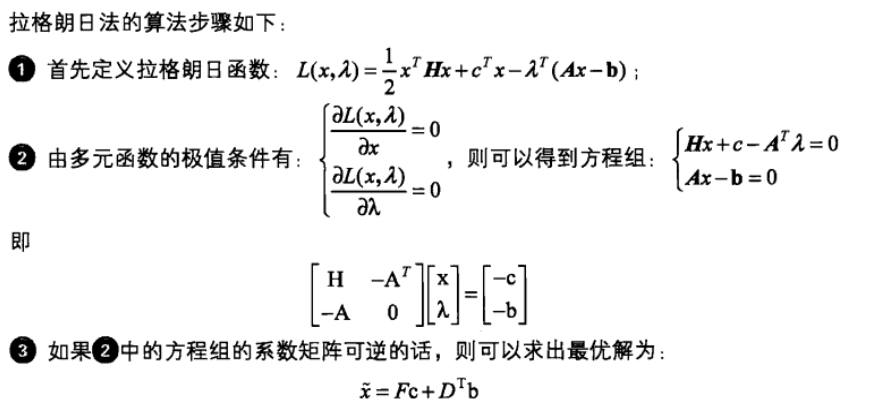

二次优化问题

# QP(quadratic program)

## 等式约束

$$
\text{minimize}\quad \quad\frac{1}{2}x^THx + c^Tx\\
\text{subject to}\quad \quad \quad\quad \quad Ax = b
$$

> 求解拉格朗日极值得到问题最优解。


$$
F=H^{-1}A^T(AH^{-1}A^T)^{-1}A^{-1}-H^{-1}\\
D=(AH^{-1}A^T)AH^{-1}
$$

```matlab
function [xv,fv] = QuadLagR(H,c,A,b)
%二次带等式约束优化问题
%输入： H：正定矩阵，c：一次项系数向量； A等式约束系数矩阵； b等式约束右端向量
%输出： xv： primal value； fv：minimal value

invH = inv(H);
F =  invH*transpose(A)*inv(A*invH*transpose(A))*A*invH - invH;
D = inv(A*invH*transpose(A))*A*invH;
xv = F*c + transpose(D)*b;
fv = transpose(xv)*H*xv/2+transpose(c)*xv;
```


## 一般问题

>quadratic program (QP) if the objective function is (convex) quadratic, and the constraint functions are affine.

$$
\text{minimize}\text{ } \frac{1}{2}x^TPx + q^Tx + r\\
\text{subject to} \text{ } Gx \preceq h \\
Ax = b
$$

其中，$P\in S^n_+,\quad G\in R^{m\times n},\quad A\in R^{p\times n}$

minimize a convex quadratic function over a polyhedron


- QCQP(quadratically constrained quadratic program)

> the inequality constraint functions are (convex) quadratic,

$$
\text{minimize} \text{ } (1/2)x^TP_0x + q^T_0x + r_0 \\
\text{subject to}\text{ } (1/2)x^TP_ix + q^T_i x + r_i ≤ 0, i = 1, . . . ,m \\
Ax = b
$$

$P_i ∈ S_n^+$ 

> objective and constraints are convex quadratic 

if $P_1, . . . , P_m ∈ S^n _{++}$, feasible region is intersection of m ellipsoids and an affine set

- Second-order cone programming

$$
\text{minimize}\text{ } f^Tx \\
\text{subject to}\text{ } ||A_ix+b_i||_2 \leq c_i^Tx+d_i, \quad i=1,...,m\\
Fx = g
$$

$( A_i ∈ R^{n_i× n} , F ∈ R^{p × n} )$

• inequalities are called second-order cone (SOC) constraints:
$$
( A_ix + b_i, c^T_i x + d_i) ∈ \text{second-order cone in}\ R^{n_i+1}
$$
• for $n_i = 0$, reduces to an LP; if $c_i = 0$, reduces to a QCQP 

• more general than QCQP and LP


