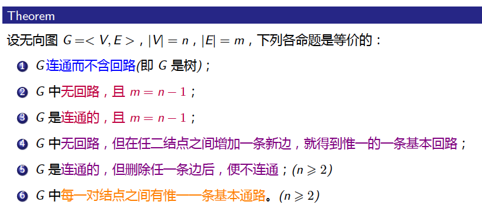

---

layout:     post                    # 使用的布局（不需要改）
title:      图论               # 标题 
subtitle:   仰望星空，脚踏实地 #副标题
date:       2019-09-13              # 时间
author:     BY Seaside                     # 作者
header-img: img/memory/1.jpeg    #这篇文章标题背景图片
catalog: true                       # 是否归档
tags:                               #标签
    - Graph Theory
---

# 一、图的基本概念

## 基本定义

- 无向图

> $G = (V,E)$  , V 顶点集， E边集
>
> 
>
> G为一个有非空集合V上定义了一个反自反，对称的二元关系E的有限系统

生成子图

> 就是包含G所有顶点的子图。

导出子图

> 设S为图G的顶点集V的非空子集，则G的以S为顶点集的极大子图

### **度**

**正则图**

> 图G称为r度正则图，如果所有顶点最大度，最小度为r。 如果一个具有p个顶点的图的p-1正则图，称为p个顶点的完全图，记为$K_p$.

### 图的同构

> $G=(V,E), H=(U,F)$ 。如果存在一个一一对应$\phi:V \rightarrow U$, 使得$uv \in E $ 当且仅当$\phi(u)\phi(v) \in F$, 则G与H同构，记为$G \cong H $.

## 连通图、补图、偶图

### 概念

通道：G的顶点和边的交错序列， $v_0,x_1,v_1,x_2,…, v_{n-1}, x_n,v_n$

通道：$v_0=v_n$时，此通道为闭通道

迹：通道上各边互不相同

路：通道上各顶点互不相同

圈：闭通道上各顶点互不相同

连通图：G中任意两个不同顶点间至少有一个路连结的图

支：G的极大连通子图

**判定是否连通**

> G有p个顶点。若任意两个不邻接的顶点顶点，v，有
>
> $deg \ u + deg\ v >= p-1$， 则G连通

2.4 几类证明方法

2.5 判定是否有圈

2.6 关于路和圈的一个定理

2.7 补图

### 偶图

**充分必要条件**

2.9 图兰定理

2.10 极图理论

## 欧拉图

欧拉通路

欧拉回路

> 设G 是无孤立结点的图，若存在一条通路(回路)，经过图中每边一次且仅一次，则称此通路(回路) 为该图的一条欧拉通路(回路)。具有欧拉回路的图称为欧拉图

无向欧拉图的判定定理

> 无向图G具有欧拉通路，当且仅当**G**是连通图且有零个或两个奇数度顶点。
>
> 无向图G具有欧拉回路，当且仅当**G**是连通图且所有节点度数为偶数。

有向欧拉图的判定定理

欧拉定理的扩展

## 哈密顿图

> 若存在一条通路或回路，经过图中每个节点一次且仅一次，则称此通路/回路为图的一条哈密顿通路/回路。具有哈密顿回路的图称为哈密顿图。 

### 回路判定的必要条件

## 判定的充分条件

## 图的表示、带权图

5.1 邻接矩阵

5.2 邻接表

5.3 关联矩阵

性质

可达矩阵

5.5 带权图

第5讲测验

# 二、树、割集

## 概念

> 连通无圈的图为树
>
> 树中度数为1 的结点称为叶(leaf)；
>
> 每个连通分支都是树的无向图称为森林；
>
> 平凡图称为平凡树(trivial tree)。

## 性质

> 任意非平凡树T = (n; m) 都至少有两片叶。

6.3 极小连通图

6.4 树的中心

## 生成树

> 给定图G = <V, E>，若G 的某个生成子图是树，则称之为G 的生成树(spanning tree)，记为$T_G$。生成树$T_G$中
>
> 的边称为树枝。G 中不在$T_G$ 中的边称为弦，$T_G$ 的所有弦的集合称为生成树的补。

> 一个图G =< V; E > 存在生成树$T_G =< V_T, E_T > $的充分必要条件是G 是连通的。

### **生成树算法**

- 破圈法: 循环找到图中的回路并删除回路中的一条边，直到删除的边的总数为m - n + 1。
- 避圈法: 循环选取G 中一条与已选取的边不构成回路的边，直到选取的边的总数为n - 1。
- 广度优先搜索算法

### 最小生成树

> 设G =< V; E > 是连通的赋权图，T 是G 的一棵生成树，T 的每个树枝所赋权值之和称为T 的权，记为w(T)。G 中具有最小权的生成树称为G 的最小生成树(minimal spanning tree)。

 割点

> 设v是图G的割点。如果G-v的支数大于G的支数，则顶点v是G的一个割点。

6.8 割点的性质

# 三、图的连通度和匹配

7.1 背景

7.2 顶点连通度和边连通度

7.3 顶点连通度和边连通度的关系

7.4 n连通

7.5 明格尔定理

7.6 柯尼希定理

7.7 网络流问题

第7讲测验

### 匹配

8.1 独立集

8.2 偶图的匹配

8.3 偶图匹配的条件

8.4 相异代表系

### 匹配

匹配的判定

# 五、平面图和顶点着色问题

## 欧拉公式

9.4 例题

9.5 非哈密顿平面图

## 着色

10.1 图的顶点着色

10.2 色数的上、下界

10.3 四色定理 vs 五色定理

第10讲测验

# 五、有向图

## 基本概念

> 定义：
>
> D =( V, A) 

计数

> |V| = P时，
>
> 无向图个数：$2^{C_p^2}$， 有向图个数$2^{P^2-P}$ 
>
> 有q条边的有向图个数$C_{p^2-p}^q$ 

有向图中顶点的度

有向完全图

同构

## 有向路、有向圈

> （闭）有向通道
>
> 迹
>
> 路

- 可达

- 连通性
  1. 弱连通
  2. 单向联通
  3. 强连通

- 强支

互达

> 等价关系

## 应用

- DAG 有向无环图

> 最长路
>
> 拓扑排序

- OS
- 交通控制

## 邻接矩阵

- 通道数

- 可达矩阵

- 强支： $R \and R^T$

 

## 根树

连通无弱圈

### 有序和k 元树

**满k 元树的性质**

> 在满k 元树中，若叶数为t，分支点数为i，则有(k -1) *  i = t - 1。

**二元有序树**

> 每个结点v 至多有两个儿子，分别称为v 的左儿子和右儿子。二元有序树的每个结点v 至多有两棵子树，分别称为v 的左子树和右子树。

堆

### 比赛图

### 最优树与哈夫曼算法

前缀码

用二元树产生二元前缀码

最优树

### 编码

- 哈夫曼算法

  > 求最优树的方法

前缀码构造

