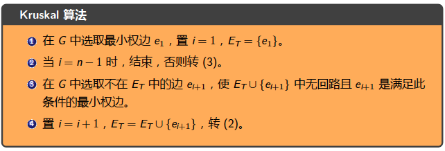
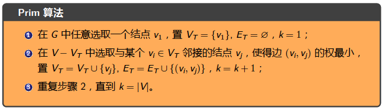

---

layout:     post                    # 使用的布局（不需要改）
title:      我是标题               # 标题 
subtitle:   仰望星空，脚踏实地 #副标题
date:       2019-05-12              # 时间
author:     BY Seaside                     # 作者
header-img: img/memory/1.jpeg    #这篇文章标题背景图片
catalog: true                       # 是否归档
tags:                               #标签
    - CS
---

求无向图的欧拉回路-Fleury算法

# 数

## 最小生成树

- Kruskal 算法

> 克鲁斯克尔(Kruskal) 于1956 年将构造生成树的避圈法推广到求最小生成树，其要点是，在与已选取的边不构成回路的边中选取最小者。

- Prim 算法

> 要点是从任意结点开始，每次增加一条最小权边构成一棵新树。

## 根数的遍历

- 先根遍历

- 中根遍历

- 后根遍历

应用

表达式的二叉树

> 1. 对表达式的二叉树进行先根遍历时，就得到了它的前缀形式。前缀形式的最大优点是无二义性，所
>
> 以不再需要括号。写成前缀形式的表达式称为**波兰符号法**。表达式的求值方式是从右向左。
>
> 2. 对表达式的二叉树进行后根遍历时，就得到了它的后缀形式。后缀形式同样无二义性，自然也不需
>
> 要括号。写成后缀形式的表达式称为**逆波兰符号法**。表达式的求值方式是从左向右。

