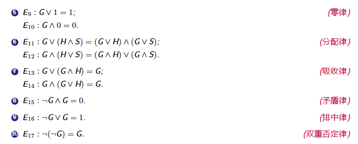

---

layout:     post                    # 使用的布局（不需要改）
title:      我是标题               # 标题 
subtitle:   仰望星空，脚踏实地 #副标题
date:       2019-05-12              # 时间
author:     BY Seaside                     # 作者
header-img: img/memory/1.jpeg    #这篇文章标题背景图片
catalog: true                       # 是否归档
tags:                               #标签
    - CS
---

# 学习路径

[哈工大 集合论与图论学习指南](http://www.icourses.cn/sCourse/course_5979.html)中包含全部重点概述。

# 全局观

## 第一部分 数理逻辑

​     计算机是数理逻辑和电子学相结合的产物

**命题逻辑**

**一阶逻辑**

## 第二部分 集合论

​        集合：一种重要的数据结构 

​        关系：关系数据库的理论基础

​        函数：所有计算机语言中不可缺少的一部分

**集合的基本概念和运算**

**二元函数和关系**

## 第三部分 抽象代数

​        计算机编码和纠错码理论

​        数字逻辑设计基础

​        计算机使用的各种运算

**代数系统的一般性质**

**典型的代数系统**

## 第四部分 图论

​        数据结构、操作系统、编译原理、计算机网络原理的基础 

# 数理逻辑

## 命题

原子命题，复合命题

## 公式

命题公式: 命题演算的合式公式(well formed formula，wff)，又称命题公式(简称公式)，

由公式G 在其所有可能的解释下所取真值构成的表，称为G 的真值表(truth table)。

### 基本等价关系

> 对于任意两个公式G 和H，G = H 的充分必要条件是公式G <-> H 是永真公式。

## 范式

命题变元或命题变元的否定称为文字。

有限个文字的析取称为简单析取式(或子句)

有限个文字的合取称为简单合取式(或短语)

有限个简单合取式（短语）的析取式称为析取范式(disjunctive normal form)；

有限个简单析取式（子句）的合取式称为合取范式(conjunctive normal form)。

**范式存在定理**

对于任意命题公式，都存在与其等价的析取范式和合取范式。

**主析取范式和主合取范式**

> 由于范式的不唯一性，我们考虑对构成范式的子句或短语进一步规范化，从而形成唯一的主析取范式和主合取范式。

极小项和极大项性质

**主范式求解定理**

## 命题逻辑

推理形式

判定定理

> 三个方法： 1. 真值表技术 2. 公式转换法 3. 主析取范式法。

推理定律–基本蕴涵关系

## 命题演绎推理

自然演绎法

> 三个推理规则加上全部的基本等价公式和基本蕴涵公式，可作为推理与演绎的基础，从而构造一个完整的命题演算推理系统。即所有命题逻辑的定理都可以用这些规则严格地证明出来。

演绎–直接证明法

演绎–规则CP 证明法

演绎–间接证明法（反证法，归谬法）

## 谓词逻辑

> 在原子命题中，可以独立存在的客体（句子中的主语、宾语等），称为个体词。而用以刻划客体的性质或客体之间的关系即是谓词。
>
> 表示具体性质或关系的谓词称为谓词常量。
>
> 表示抽象的或泛指的性质或关系的谓词称为谓词变量。

量词

谓词逻辑符号化的两条规则

**四类符号**

自由变元与约束变元

规则1：约束变元的改名规则

规则2：自由变元的代入规则

设G 是任意一个公式，若G 中无自由出现的个体变元，则称G 为封闭的合式公式，简称**闭式**。

**公式的等价**

前束范式

### **谓词逻辑推理**

全称特指规则

存在特指规则

全称推广规则

存在推广规则

