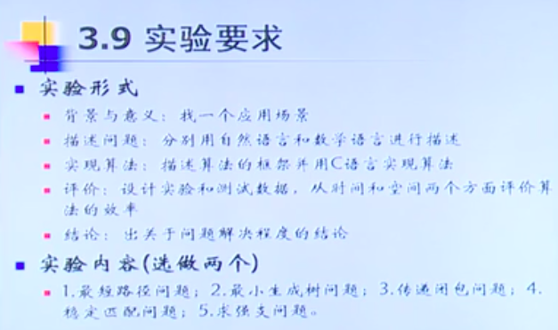

---

layout:     post                    # 使用的布局（不需要改）
title:      我是标题               # 标题 
subtitle:   仰望星空，脚踏实地 #副标题
date:       2019-05-12              # 时间
author:     BY Seaside                     # 作者
header-img: img/memory/1.jpeg    #这篇文章标题背景图片
catalog: true                       # 是否归档
tags:                               #标签
    - CS
---

# 课程实验

### 传递闭包问题（关系运算的布尔矩阵）

由R的布尔矩阵B，利用公式3.5.3，计算传递闭包A（即是$B^+$) 。

 $$ B^+ = B \bigvee B^{(2)} \bigvee …  \bigvee B^{(n)}  $$

#### 用处

在语法分析中，常常通过求定义在某字母表上的有关语法规则的二元关系的传递闭包，来计算非终结符所能导出的字符集。

#### Warshall算法

[code](https://gist.github.com/seaside2mm/510c359f24e3b3e7ca6ec126742b6af0)

算法描述：

> 1. $A \leftarrow B$
>
> 2. $k \leftarrow  1$ 
>
> 3. $ i \leftarrow  1$ 
>
> 4. for $j \leftarrow 1$ to n do
>
>    $a_{ij} \leftarrow a_{ij}  \bigvee (a_{ik} \bigwedge a_{kj})$
>
> 5. $ i \leftarrow i+1$, if $i\leq n$ then goto 4 
>
> 6. $ k \leftarrow k+1$, if $k\leq n$ then goto 3 else stop

由于第4步， i, k定值， 可简化成： 如果$a_{ik}=1$,  $a_{ij} \bigvee (a_{ik} \bigwedge a_{kj}) = a_{ij} \bigvee a_{kj}$

- floyd

## 图是否有圈问题，是否连通

# CJ刷题

[集合论]([http://codevs.cn/problem/?q=%E9%9B%86%E5%90%88](http://codevs.cn/problem/?q=集合))

- 1019 集合论与图论