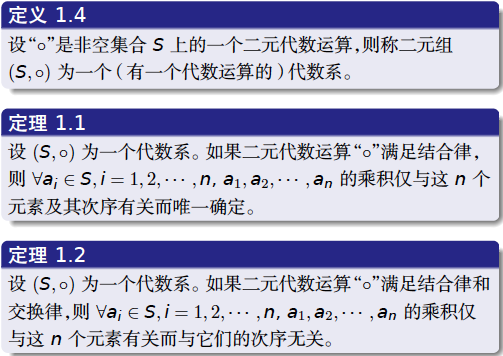
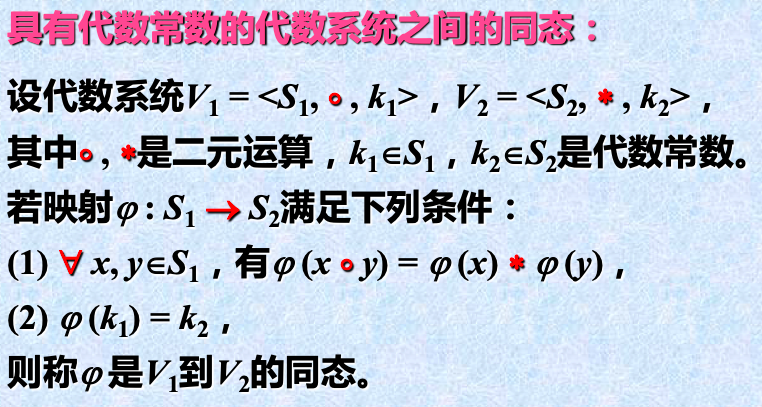
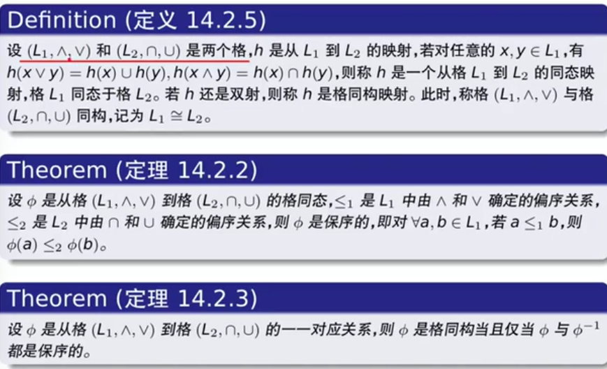

学着集合论也就顺便跟着哈工大把近世代数学上了。第一次听说也说大二听着数学系姜艳梅学姐提起这门的难度。本着对还对数学的丝丝热爱，也就尽力攻下这一城。以下为学习路径。

视频参考：[网易云](https://mooc.study.163.com/course/1000003009?tid=1000002009#/info)或者[bilibili](https://www.bilibili.com/video/av32710825/)

网易云有周测评

[代数结构入门：群、环、域、向量空间](http://sparkandshine.net/algebraic-structure-primer-group-ring-field-vector-space/)

- 参考

1. [抽象代数|笔记整理（1）——群，子群，同态](https://zhuanlan.zhihu.com/p/30384157?group_id=906969603532791808)
2. [抽象代数|笔记整理（2）——同构，划分，陪集](https://zhuanlan.zhihu.com/p/30496016)
3. [抽象代数|笔记整理（3）——陪集与阶，直积，商群，群作用](https://zhuanlan.zhihu.com/p/30668738)
4. [抽象代数|笔记整理（4）——轨道，中心，西罗子群](https://zhuanlan.zhihu.com/p/30797590)
5. [抽象代数|笔记整理（5）——群阶数，西罗定理](https://zhuanlan.zhihu.com/p/30845557)
6. [抽象代数|笔记整理（6）——环，多项式环，理想](https://zhuanlan.zhihu.com/p/31441459)
7. [抽象代数|笔记整理（7）——商环，整环与分式域，极大理想](https://zhuanlan.zhihu.com/p/31516301)
8. [抽象代数|笔记整理（8）——序，代数几何引入，模](https://zhuanlan.zhihu.com/p/31909442)
9. [抽象代数|笔记整理（9）——域，域的扩张](https://zhuanlan.zhihu.com/p/32152134)
10. [抽象代数|笔记整理（A）——二次扩域，有限域，分裂域](https://zhuanlan.zhihu.com/p/32418036)
11. [抽象代数|笔记整理（B）——历史遗留习题及解答](https://zhuanlan.zhihu.com/p/32530225)
12. [梓陌：高斯整环商环和剩余类环同构的微小结论](https://zhuanlan.zhihu.com/p/55240933)
13. [李泽龙：有限群按照阶数分类的问题感想](https://zhuanlan.zhihu.com/p/69254703)

# 0. 序

## 数学归纳法

最小数原理，良序原理，Well-Ordering Principle

> 集合Z+ 的每一个非空子集都有一个最小元素。

- 第一数学归纳法

> 设P(n) 是关于正整数n 的一个命题，如果下面的两个事实成立：
>
> （1）P(1) 是真的；
>
> （2）对于每一个正整数k，如果P(k) 是真的，那么P(k + 1)也是真的。
>
> 在这种情况下，我们就能够得出结论：对于所有的正整数n，P(n) 都是真的。

- 第二数学归纳法

> 设P(n) 是关于正整数n 的一个命题，如果下面的两个事实成立：
>
> （1）P(1) 是真的；
>
> （2）对于每一个正整数m，如果对于所有正整数k < m，P(k)是真的，那么P(m) 也是真的。
>
> 在这种情况下，我们就能够得出结论：对于所有的正整数n，P(n) 都是真的。

## 基本概念

- 二元运算

1. 设X 是一个集合，一个从$X\times  X$ 到X 的一个映射φ 称为X上的一个**二元代数运算**。
2. 一个从集合X 到集合Y 的映射称为X 到Y 的一个一元代数运算。当X = Y 时，称此一元代数运算为X 上的**一元代数运算。**

- 二元运算的性质

运算律

> 结合律
>
> 交换律
>
> 幂等律
>
> 分配律
>
> 吸收律
>
> 消去律 

- 集合***S***的特殊元

> 幺元, 
>
> **零元**：z ◦ a = a ◦ z = z，则称z 为乘法“◦”的零元素。
>
>  **逆元**

## 代数系统

由一个非空集合S以及定义在D上的若干个代数运算组成的一个系统。

**Definition:** ![[公式]](https://www.zhihu.com/equation?tex=S) 是一个集合，关于 ![[公式]](https://www.zhihu.com/equation?tex=S) 的一个二元关系是一个从 ![[公式]](https://www.zhihu.com/equation?tex=S%5Ctimes+S) 到 ![[公式]](https://www.zhihu.com/equation?tex=S) 的映射。它的映射形式是 ![[公式]](https://www.zhihu.com/equation?tex=%2A%28a%2Cb%29%3Da%2Ab%28a%2Cb%5Cin+S%29) ，并且要求满足: 

(1)无缺陷(well-defined):对于任意的 ![[公式]](https://www.zhihu.com/equation?tex=a%2Cb+%5Cin+S) ，恰好有一个 ![[公式]](https://www.zhihu.com/equation?tex=c+%5Cin+S) 使得 ![[公式]](https://www.zhihu.com/equation?tex=a%2Ab%3Dc)
(2)封闭性(closure):对于任意的 ![[公式]](https://www.zhihu.com/equation?tex=a%2Cb+%5Cin+S) ， ![[公式]](https://www.zhihu.com/equation?tex=a%2Ab+%5Cin+S)

# 1. 半群和幺半群

## 1.1 基本概念

- 半群

> 设(S, ◦) 是一个代数系, 如果“◦“满足==结合律==，那么就称S 对于乘法“◦“构成一个半群Semigroup，记为(S,◦)。

- 幺半群

> 由==单位元素==的半群，$(S,\circ,e)$

- 元素的幂

## 1.2 子半群，子幺半群, 理想

> 子集合对运算封闭

- 理想

- 循环半群

现在我们有了半群的基本定义和性质后，就更加需要研究映射，因为代数的很多性质都是在映射中出现的。而群同态/同构不过是从半群的基本性质中引申出来的而已。

## 1.3 同态

同态的概念可以理解为就是二元关系在映射意义上的推广。

### 同态的推广

### 同态的意义

## 1.4 同构

证明：

1. 单射(injective)：对于任意的两个象中的元素，如果两个元素相同，那么它们对应的原象的元素相同。

2. 和满射(surjective)：对于任意的象中的元素，我都可以找到一个原象，其映射后就是象中那个元素。

3. 同态

### cayley 定理

> 任何幺半群$(M, \circ, e)$同构于变换幺半群$(L(M), \circ, I_M)$.

## 1.5 幺半群的同态基本定理

同余关系也就是运算的等价关系。

提供了一种思维方法。同态到同构的转化。

# 2. 群

## 2.1 群的定义

> 在代数系中的一个集合G以及一个二元运算关系，满足以下三点：
>
> （1）结合律（2）幺元 （3）逆元

交换群/阿贝尔群 

> 满足交换关系

群的例子

n次对称群      阿贝尔群群的阶      模n剩余类加群    

## 2.2 群的简单性质  

> 任意一个群的单位元唯一，左幺=右幺
> 任意一个群的元素的逆元唯一，左逆=右逆
>
> $(a^{-1})^{-1} = a,    (ab)^{-1} = b^{-1}a^{-1}$

### 阶

##  2.3 子群、生成子群  

### 子群

非空子集，且运算封闭

补充：子群交还是子群

`定理12.3.2`等价于 $ab^{-1} \in S$

举例：

### 生成子群  

 

## 2.4 变换群和同构  

- 群的同构 

### 变换群和置换群 

- 置换群

> 当|S|= ***n*****时，**S上共有n!种不同的n元置换，将这些置换构成的集合记作$S_n$

- 变换群

 从S->S的映射，保持不变性。

对称群 ![[公式]](https://www.zhihu.com/equation?tex=S_3) 一个比较常用的定义

![[公式]](https://www.zhihu.com/equation?tex=S_3%3D%5C%7B1%2Cx%2Cy%2Cxy%2Cx%5E2y%2Cx%5E2+%5Cmid+x%5E3%3D1%2Cy%5E2%3D1%2Cyx%3Dx%5E2y%5C%7D)

### 群的cayley同构定理   

任何一个抽象的群都可以在变换群中找到具体实例；

任何一个抽象的有限群都可以在对称群中找到具体实例，即在对称群的子群中中找到实例。

变换群与置换群比较具体，其元素一一对应，代数运算算是一一对应的合成。

### 自同构群

### 共轭关系     

> 定义：设 ![[公式]](https://www.zhihu.com/equation?tex=G) 是一个群， ![[公式]](https://www.zhihu.com/equation?tex=a%2Cb+%5Cin+G) ，如果存在 ![[公式]](https://www.zhihu.com/equation?tex=g+%5Cin+G) 满足 ![[公式]](https://www.zhihu.com/equation?tex=a%3Dgbg%5E%7B-1%7D) ，那么 ![[公式]](https://www.zhihu.com/equation?tex=a%2Cb) 共轭。

## 2.5 循环群  

同构意义下的循环群: 无限循环群只有一个，有限循环群也只有一个

- 循环群的子群   

 ## 2.6 子群的陪集与拉格朗日定理  

### 划分

如果 ![[公式]](https://www.zhihu.com/equation?tex=S) 不是一个空集并且可以写成一系列互相之间不相交的子集的并，那么我们说这些子集构成了 ![[公式]](https://www.zhihu.com/equation?tex=S) 的一个划分。因此，一个集合如果存在一个等价关系，那么我一定有办法对集合做一个划分。

具体等价关系与划分，商集见集合论。

### 陪集    

左陪集间关系的性质定理      左陪集集簇对群的划分      群对子群的指数      

- 拉格朗日定理及应用  

## 2.7 正规子群、商群  

两个子群的乘积为子群的判定条件      正规子群及判定定理      商群      换位子群      

### 正规子群

## 2.8 同态基本定理

> **Definition:Kernel,Image**
> 设 ![[公式]](https://www.zhihu.com/equation?tex=G%2CG%27) 为两个群，对于一个映射 ![[公式]](https://www.zhihu.com/equation?tex=%5Cphi%3A+G+%5Cto+G%27) ，我们有
> ![[公式]](https://www.zhihu.com/equation?tex=Ker%5Cphi%3D%5C%7Bx+%5Cin+G+%5Cmid+%5Cphi%28x%29%3De%27%5C%7D) ![[公式]](https://www.zhihu.com/equation?tex=Im%5Cphi%3D%5C%7B%5Cphi%28x%29+%5Cmid+x+%5Cin+G%5C%7D)

 ## 2.9 直积

# 3. 环和域

## 3.1 环和域的定义与简单性质  

### 环

- 零因子  

### 无零因子环 and 体和域      

​      

## 3.2 无零因子环的特征数  

环中元素对加法的阶      无零因子环中元素对加法阶的唯一性      特征数      体和域的特征    

## 3.3 同态基本定理

### 同态与同构     

  

### 理想子环及判定条件  

理想子环作用类似于正规子群，可以做成商环。   

 ### 环的同态基本定理

- 定义13.4.1

> 设$\phi$是环R到$\bar R$的满同态，$\bar 0$ 是$\bar R$的零元素。R的理想子环$\phi ^{-1}(\bar 0)$ 称为同态$\phi$的内核，记为$Ker(\phi)$
>
> 故，$Ker(\phi) = \phi ^{-1}(\bar 0)$  

- 定理13.4.2

> 若N是环的一个理想子环，则$R \sim  R/N$, N是这个同态的核。

- 定理13.4.3 同态基本定理

> 设$\phi$是环R到$\bar R$的满同态，则 $R/Ker\phi \simeq \bar R$

## 3.4 极大理想      费马定理

- 费尔马定理

# 格

- 偏序关系

## 4.1 格的定义及简单性质

性质

## 4.2 对偶原理、作为代数系的格  

偏序、上界、上确界、下界、下确界      极大元、极小元      偏序格      偏序格的性质      偏序与上下确界的关系      对偶原理

- 代数格   

 

## 4.3 某些特殊的格  

### 子格      

### 格的同态与同构  

格同构的保序性          

### 完备格，有界格，补元素

### 分配格      

布尔代数

# 布尔代数

