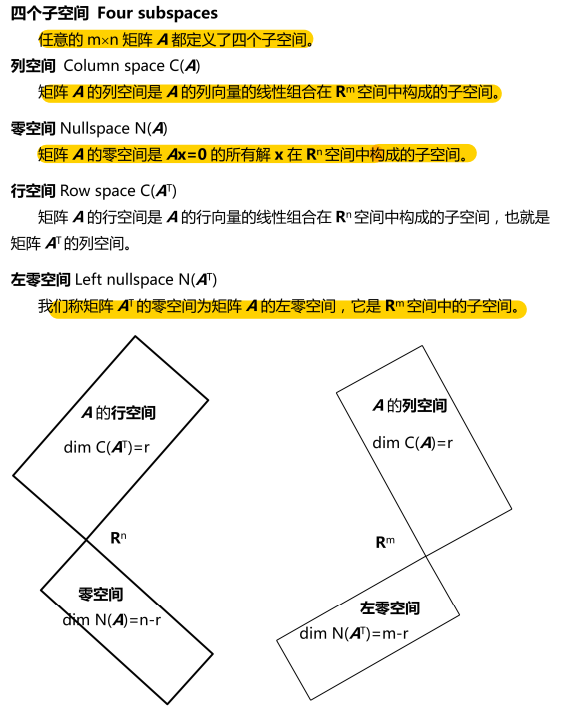
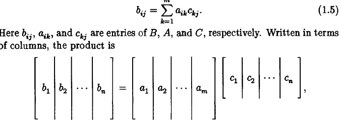
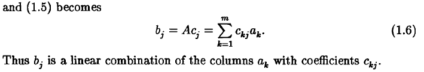
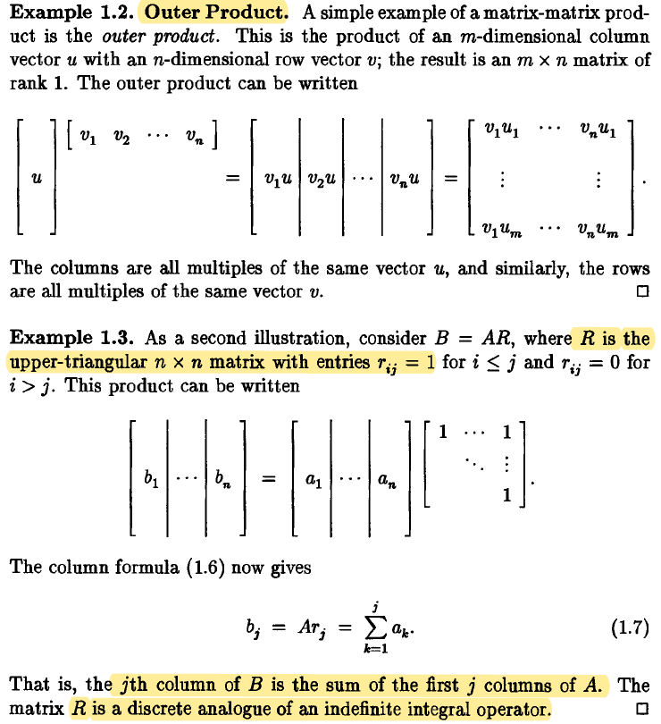

# 线性方程组的几何图像

- 行图像

  > 解析几何的描述

- 列图像

  > 向量的线性组合

  

> 对矩阵进行行操作不会改变$Ax=b$的解，因此不会改变零空间。但会改变列空间。

> 考虑矩阵的秩
>
> The range or column space of A is the set of all such linear combinations. range(A) is a vector space of dimension  n. Its dimension is called the rank or column rank of A.
>
> $rank(A) = n$ : A has full rank
>
> $rank(A) < n$ : A is rank-deficient

> 考虑$Ax=b$
>
> 1. Suppose A is square and nonsingular, i.e., of full rank n.
>
> Then Ax = b has a unique solution for each b: $x = A^{−1}b$. $(b_1, . . . , b_n)^T$ : data vector
>
> $(x_1, . . . , x_n)^T$ : coefficient vector
>
> Thus if b is a data vector, $A^{−1}b$ is a coefficient vector.
>
> ==**Solution of system of equations $\leftrightarrow$ coefficient vector for an expansion**==

> 考虑最小二乘 least-squares.
>
> A has more rows than columns. Then unless b happens to be in range(A), Ax = b has no solution.
>
> However, one can still look for approximations $Ax = b$.
>
> This will lead us to least-squares.

> 考虑连续函数
>
> Suppose each column of A is a function of a continuous
>
> variable t, and likewise b. We say that A is an $\inf \times  n$ quasimatrix.
>
> Thus $a_j = a_j(t) $and $b = b(t)$
>
> range(A) is vector space of functions of t. $(\leq n)$
>
> $Ax = b$  may have no solution.

# 矩阵与向量乘法

- 列空间

> 对于$Ax=b$, 如果b能被A列向量张成的字空间线性表出时，方程有解。

- 化零空间Nullspace

> 矩阵A的化零空间是指满足$Ax=0$所有解的集合，也为$Ax=b$的特解向量的线性组合所构成的向量空间。自由列的数目等于特解的数目和零空间的维数。
>
> （矩阵的秩为矩阵主元的个数。包含主元的列为主元列，不包含的为自由列。）

## 基，维数与秩

> 针对线性空间，刻画子空间结构；

基：一族向量S线性无关，并可以线性表出线性空间V的任意向量。称S是V的一个基.

维数dimV：基的所含向量个数

秩：针对向量组，rankA

矩阵A的r个主元构成了列空间$C(A)$的一组基，$dimC(A)=r$;

$Ax=0$的$n-r$个自由元构成了$Null(A)$一组基，$dimN(A)=n-r$;

## 4个子空间

$\R^n, \R^m$ 空间，与行向量，列向量个数无关，与向量的元素个数有关。

- 行空间

> r阶阶梯型行向量为行空间的一组基。

行空间与零空间的向量（即解x）正交

# 矩阵与矩阵乘法

