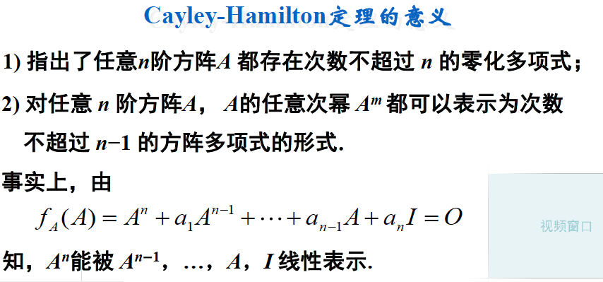

# 特征多项式

引入算子s，构造矩阵$sI-A$, 得到该矩阵行列式，
$$
C(s)=det(sI-A)=s^n+c_1s^{n-1}+...+...c_{n-1}s+c_n
$$
称为矩阵A的特征多项式。

矩阵$λI−A$对应的行列式（即$det(λI−A)$称为[特征多项式(characteristic polynomial)](https://en.wikipedia.org/wiki/Characteristic_polynomial)。它是一个关于特征值λ的n阶多项式，它的所有根即对应所有特征值。

# 方阵多项式

可以找到相似矩阵，

# 零化多项式

# 最小多项式

定义**3(**最小多项式**)**

方阵**A**的次数最低，且首一的零化多项式

称为**A**的最小多项式，用**m****A****(λ)**表示**.**

定理**4**

设方阵**A**的最小多项式为**m****A****(λ)**，则有

**1) A**的任何零化多项式都能被**m****A****(λ)**整除；

**2) A**的最小多项式**m****A****(λ)**是唯一的；

**3) λ****0**是**A**的特征值**mA(λ****0****)0.**