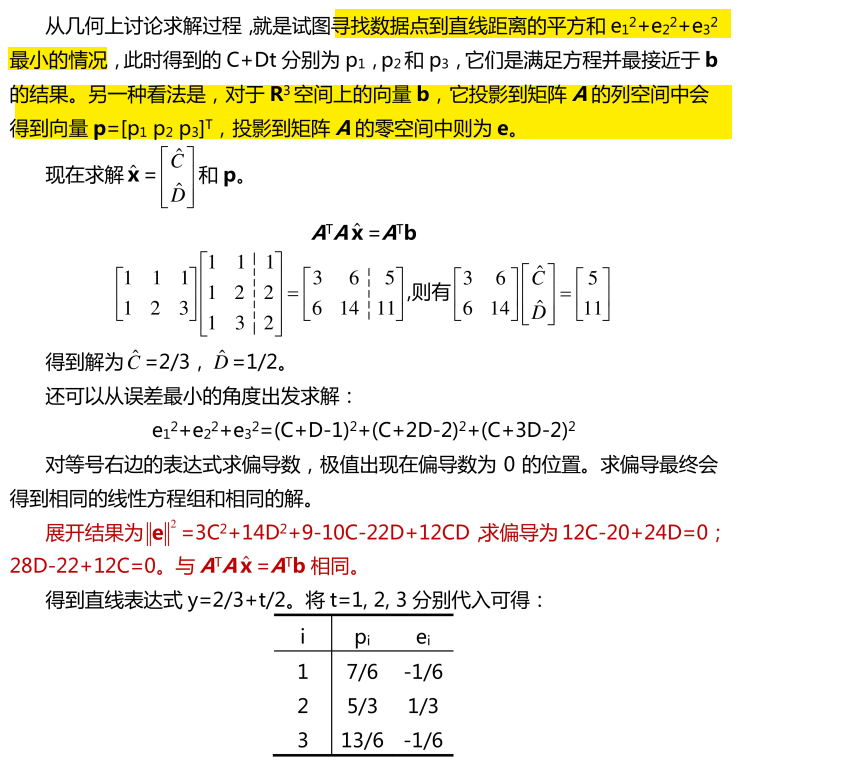
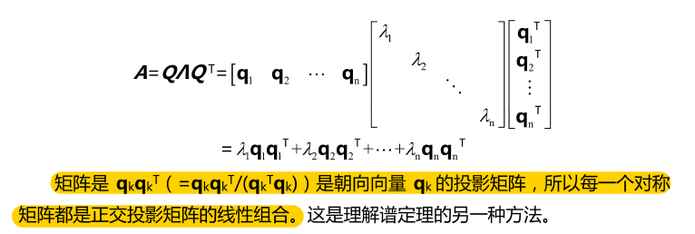

# 1 投影

## 一维情况

### 投影矩阵

## 为什么投影

## 高维情况

### 不同情形

> $I-P$投影矩阵 : 为投影到与列空间垂直的补空间

## 在基下的投影

- 正交基下的投影

在正交基$\{q_1,…,q_n\}$下，对任意向量$v$, $q_j^*v$是标量，也就是基下投影的长度。则有向量$r=v-(q_1^*v)q_1-…-(q_n^*v)q_n$正交与正交基。

因此$v$可被分解为n+1个正交元素。
$$
v=r+\sum_{i=1}^n(q_i^*v)q_i=r+\sum_{i=1}^n(q_iq_i^*)v
$$

> r is the part of v orthogonal to the set of vectors $\{q_1,…,q_n\}$, or to the subspace spanned by this set of vectors, and $(q_i^*v)q_i$ is the part of v in the direction of $q_i$.

- 非正交基下的投影

## 最小二乘法

回归问题

> $$
> min||b-Ax||^2 
> \iff A^TA\hat x=A^Tb
> $$

 

> 向量p与e正交，并且e与列空间正交

### $A^TA$

# 2 正交矩阵

- 性质

1. A可逆，则$A^{-1}=A^T$, $Q^TQ=I$

2. $||Q x||=||x||$
3. 行列向量组皆为标准正交基

4. 实可逆矩阵A可唯一分解成，正交矩阵Q与主对角元素为正的上三角矩阵R。$A=QR$

- 简化$Ax=b$线性系统

列向量表达

If $\{q_1,…,q_n\}$ are orthonormal, we get expansion coefficients via inner products:
$$
b =\sum_jx_jq_j \leftrightarrow x_j = q^T_jb
$$
矩阵表达
$$
Qx=b \leftrightarrow x=Q^Tb
$$

## 施密特正交化

## 例子

- 旋转矩阵
- reflection对称

- householder idea

if $u^Tu=1$
$$
H=I-2uu^T
$$

- Hadamard matrix

- 小波矩阵

> Haar wavelet

- 傅里叶矩阵

# 3. 特征向量和特征值

> 2个检查：（1）矩阵的trace等于特征值和；（2）矩阵的行列式值等于特征值积。

# 4 相似矩阵

# 5 对称矩阵

> 对称矩阵的特征值为实数，且拥有正交的特征向量。

# 6 正定矩阵

