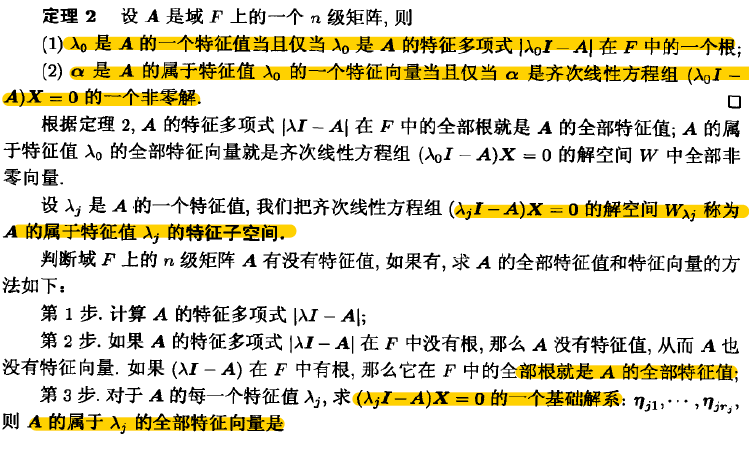
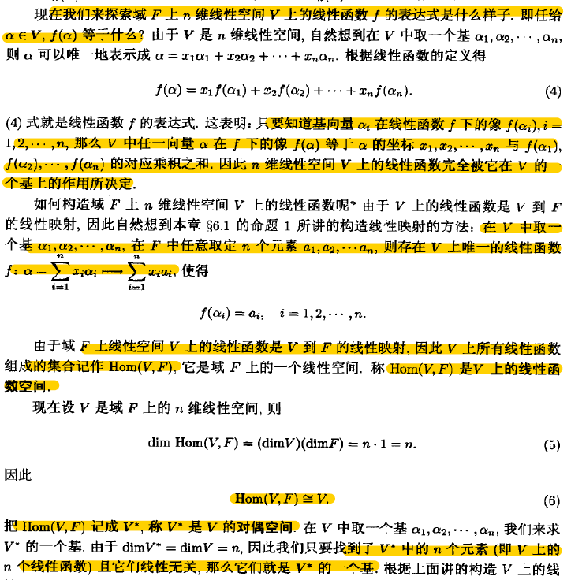

---

title:      2.线性映射
date:       2019-10-12              # 时间
author:     BY Seaside                     # 作者
categories:
- 线性代数
toc: true
---

线性变换与线性映射

# 1.基本概念

## 定义和性质

## 运算

域$V, V’$都是域F上的线性空间，把从$V$ 到$V$的所有线性映射组成的集合记为$Hom(V,V’)$;

$Hom(V,V’)$ 也是域F上的一个线性空间。

同时Hom(V,V)满足乘法的左右分配律，有单位元，所以其对加法和乘法成为一个单位元的环。

## 核与像

- 核

> 含义为**零空间**，被线性映射为零向量构成的子集。$ker T = \{v\in V|Tv=0\}$. 也是子空间。
>
> 几何上对应于垂直平面空间的空间所在直线的投影。

性质：

1. ==（重要）==设$A \in Hom(A,A’)$,  A单射，当且仅当$KerA=0$, 核为零子空间。 

- 像

> 含义为**值域**。也是子空间。

1. A是满射，当且仅当$ImA=V’$

### 线性映射基本定理

## 投影

- 定义

- 性质 

  1. $P_U^2 = P_U$， 投影是幂等变换
  2. 两个线性变化, $AB=BA=0$,  则正交。

- 投影矩阵

> Projection matrix or projector, $Px=v, Pv=v, v \in range(P)$
>
> 方阵P满足$P^2=P$
>
> 直观解释：shine a light onto the subspace range(P) from just the right direction, then $Pv$ would be the shadow projected by the vector v.

- P的零空间

- 投影的补

$(I-P)^2=I-P$ 

$I-P$ is Complementary Projectors to P， 投影到$null(P)$

> $range(I-P)=null(P),  range(P)=null(I-P)$， 
>
> $null(I-P) \jiao null(P) = {0}, range(P) \jiao null(P) = {0}$

投影算子将空间分成两个子空间$S_1, S_2$, 

$range(P)=S_1, null(P)=S_2$

- 正交投影算子Orthogonal Projectors

子空间$S_1,S_2$正交， 而不是正交矩阵。

>   几何解释: Orthogonal Projectors is any projector that is hermitian, 满足$P^*=P$.
>
> > if $P^*=P$, 两个向量，$Px\in S_1, (I-P)y\in S_2$ ，其内积为0.
> >
> > $x^*P^*(I-P)y=x^*(P-P^2)y=0$ 

### 在基下的投影

- 正交基下的投影

在正交基$\{q_1,…,q_n\}$下，对任意向量$v$, $q_j^*v$是标量，也就是基下投影的长度。则有向量$r=v-(q_1^*v)q_1-…-(q_n^*v)q_n$正交与正交基。

因此$v$可被分解为n+1个正交元素。
$$
v=r+\sum_{i=1}^n(q_i^*v)q_i=r+\sum_{i=1}^n(q_iq_i^*)v
$$

> r is the part of v orthogonal to the set of vectors $\{q_1,…,q_n\}$, or to the subspace spanned by this set of vectors, and $(q_i^*v)q_i$ is the part of v in the direction of $q_i$.

- 非正交基下的投影

- 投影分解

# 2.与矩阵的关系

可知线性变换和线性映射的矩阵表示。

## 线性映射与矩阵的关系

$V\rightarrow V’$ 的线性映射$\sigma$ ，对应$V’$的基的矩阵表示，是怎么样的关系？

下面可知，是同构映射关系，满足加法，纯量乘法，乘法三种运算。

同样也满足可逆，幂等。

另外在V下基的坐标与V’下基的坐标相等。

## 在不同基下矩阵之间的关系

### 过渡矩阵 |  相似矩阵

基之间的变换矩阵，由基==线性无关==，可推出过渡矩阵可逆。

相似关系是等价关系。等价类也称为相似类。

相似矩阵有相同行列式，相等秩。

---

## 在不同基偶下的矩阵关系

- 线性变换在基偶下的矩阵

  > 原像空间基的向量在线性变换之后，在像空间下基的 的坐标。

设T是$V^m \to V^n$ 的线性变化。$\Beta_{\alpha}, \Beta_{\tilde \alpha}$ 的$V^m$的两个基， $\Beta_{\beta}, \Beta_{\tilde \beta}$ 的$V^m$的两个基.

T在基偶$\Beta_{\alpha}, \Beta_{\beta}$下的矩阵为A，即$T\Beta_{\alpha} =  \Beta_{\beta} A$  (1);

T在基偶$\Beta_{\tilde \alpha}, \Beta_{\tilde \beta}$下的矩阵为B，即$T\Beta_{\tilde \alpha} =  \Beta_{\tilde \beta} B$ (2).

- 过渡矩阵

  > 同一个空间，另一组基的每个向量在原来基的坐标

设$\Beta_{\alpha} \to \Beta_{\tilde \alpha}$ 的过渡矩阵P，设$\Beta_{\beta} \to \Beta_{\tilde \beta}$ 的过渡矩阵Q，

$\Beta_{\tilde \alpha} = \Beta_{\alpha}P$ (3)  , $\Beta_{\tilde \beta} = \Beta_{\beta}P$ (4)

- 性质

1. 对不同空间的线性映射，由（1)(3) 与 (2)(4)， 可知，$AP=QB  \to A=QBP^{-1}$ , 

==线性变换在不同基偶下的矩阵是等价的.==

2. 对同一个空间的线性变换，$AP=PB  \to A=PBP^{-1}$ , 

==线性变换在不同基下的矩阵是相似的.== 

# 3.特征值与特征向量

特征向量在$A- \lamda I$ 的零空间中，满足$(A- \lamda I)x = 0$ 

- **常用性质**

1. 特征值之和=矩阵的迹=行列式值

2. 对称矩阵特征向量正交

特征子空间

线性变换和矩阵的特征值特征向量

接下来探讨相似的矩阵特征值与特征向量的关系？

特征多项式相等。

- 特征多项式

# 4.矩阵的相似化简

下面主要讨论$V^n$上的线性变换**T**

目标：找到$V^n$上的一个基，使得T在基下的矩阵具有比较简单的形式

(1)对角阵

(2)分块对角阵

## 可对角化

## 不变子空间

讨论如果不能对角化，可不可以也能得到一个较好的结构。

设

## Jordan标准型

如果特征值各不相等时，则能相似于对角阵。

如果特征值有相等时，则不能相似于对角阵，只能相似于Jordan矩阵。

两个矩阵相似于相同的Jordan矩阵，则相似。

# 5.对偶空间

“对偶空间”是“线性空间”，它里面的元素是“线性映射”。

## 线性函数

> V上的线性函数是V到F的映射。n维线性空间的线性函数被它所在V上的一个基所决定。

## 对偶空间

> V上所有线性函数的集合$Hom(V,F)$, 记为$V^*$. 

---

## 对偶基

> V的基$\alpha_1,…,\alpha_n$, 对偶基$f_1,…,f_n$

## 过渡矩阵之间关系

## 双重对偶空间

