# 线性空间

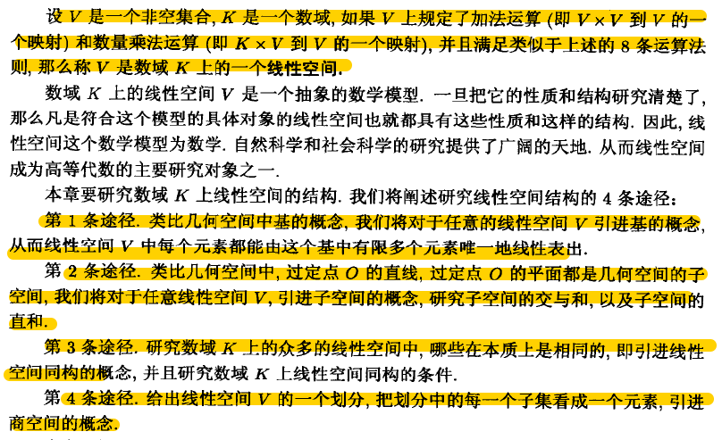

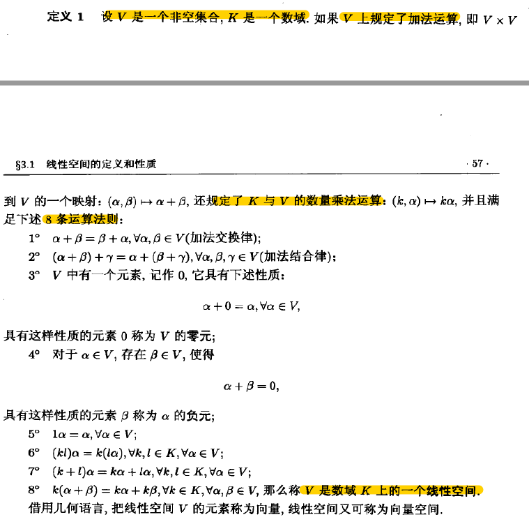

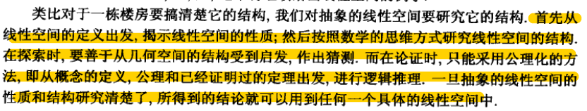

## 0. 线性表示

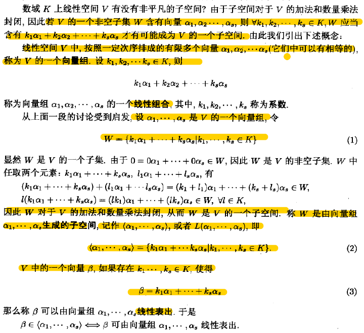

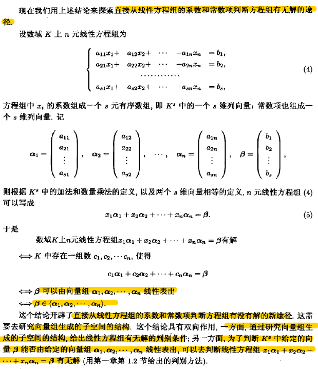 

### 线性相关 | 线性无关

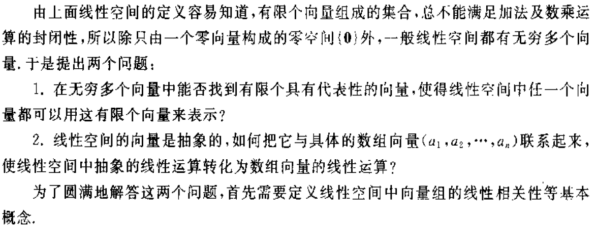

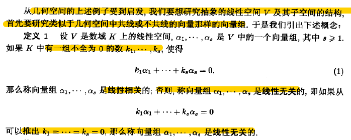

## 1. 基,维数与秩

- 基与维数

> 针对线性空间，刻画子空间结构；
>
> 基：一族向量S线性无关，并可以线性表出线性空间V的任意向量。称S是V的一个基
>
> 维数dimV：基的所含向量个数

> 矩阵A的r个主元构成了列空间$C(A)$的一组基，$dimC(A)=r$;
>
> $Ax=0$的n-r个自由元构成了A的零空间一组基，$dimN(A)=n-r$;

- 基下向量的坐标

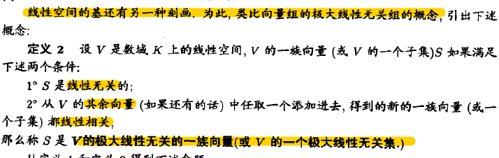

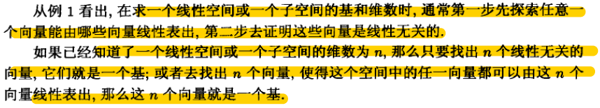

- 秩

  > 针对向量组，rankA

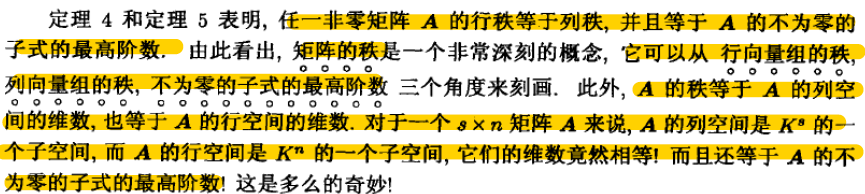

## 2. (非)齐次线性方程组

1. 线性方程组有解充要条件：它的增广矩阵和系数矩阵秩相等。

2. n元线性方程组有解时，系数矩阵秩等于n，唯一解；小于n，无穷多解。

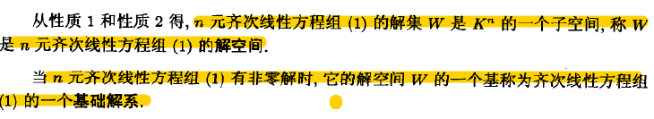

性质1，2即为加法乘法满足封闭性

- 齐次

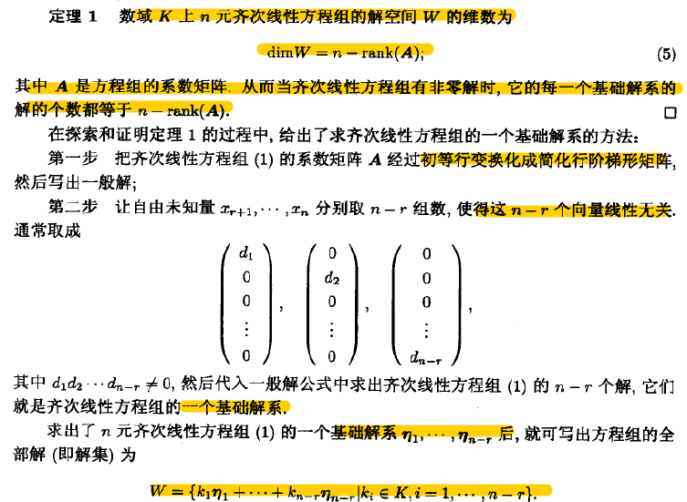

- 非齐次

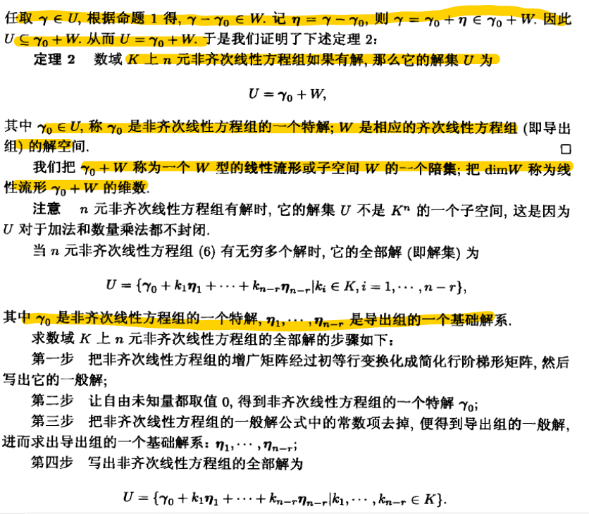

## 3. 子空间

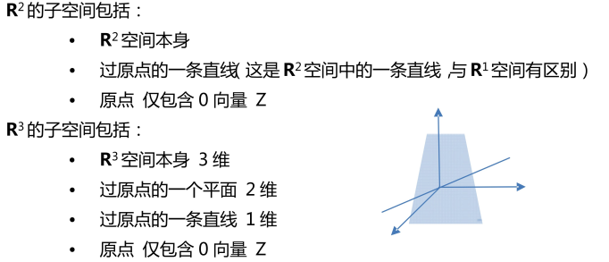

> 零空间$\{0\}$与$V$是称为$V$的平凡子空间.

- 张成的字空间

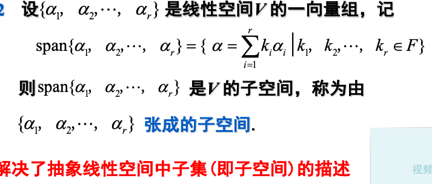

- 列空间

> 对于$Ax=b$, 如果b能被A列向量张成的字空间线性表出时，方程有解。

- 化零空间Nullspace

> 矩阵A的化零空间是指满足$Ax=0$所有解的集合，也为$Ax=b$的特解向量的线性组合所构成的向量空间。自由列的数目等于特解的数目和零空间的维数。
>
> （矩阵的秩为矩阵主元的个数。包含主元的列为主元列，不包含的为自由列。）

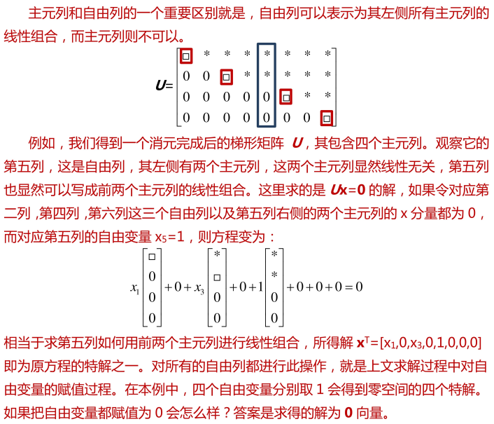

- 基扩张定理

> **设** $\{\alpha_1,…,\alpha_r\}$是${V^n}$中一组线性无关向量，则存在n-r个向量$\alpha_{r+1},…, \alpha_n$,使得$\{\alpha_1,…,\alpha_n\}$构成$V^n$的基.

- 和空间，交空间，维数公式，直和

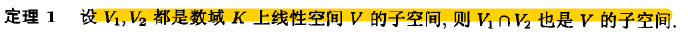

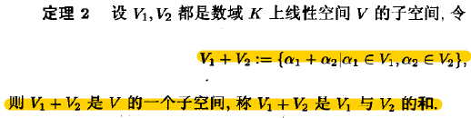

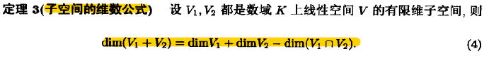

- 直和

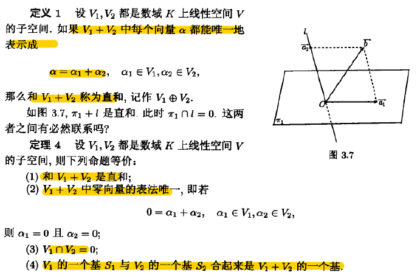

## 4. 同构

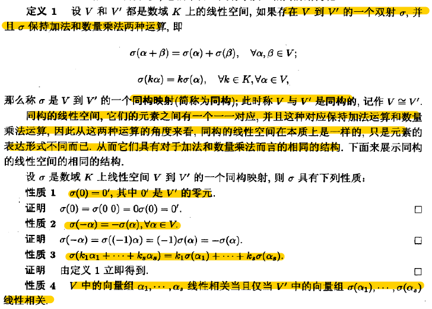

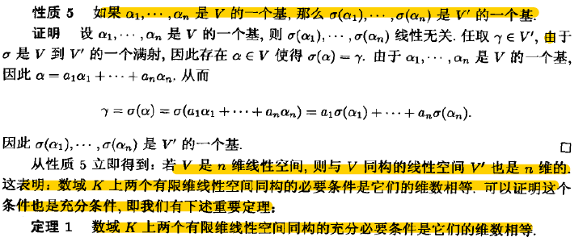

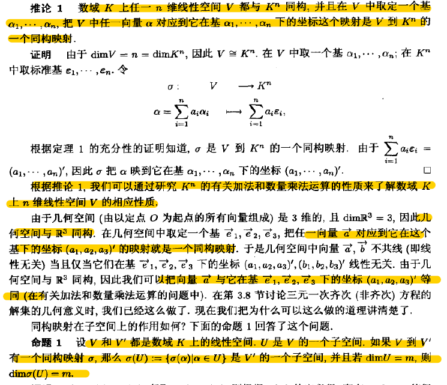

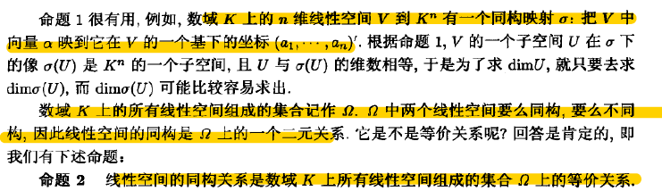

## 5. 集合的划分与商空间

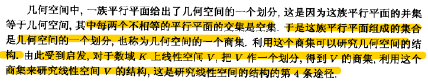

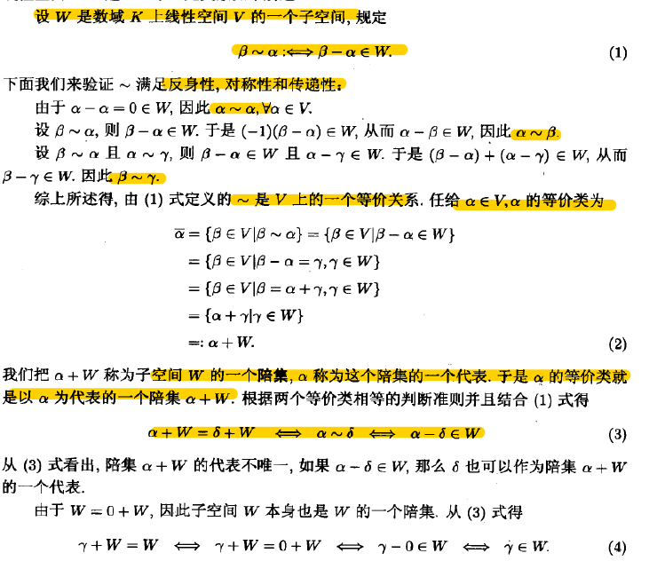

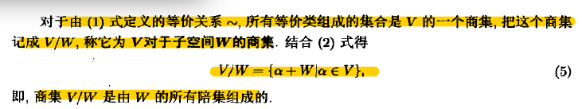

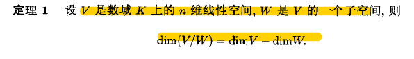

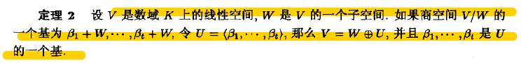

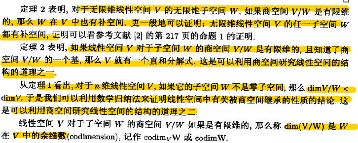

