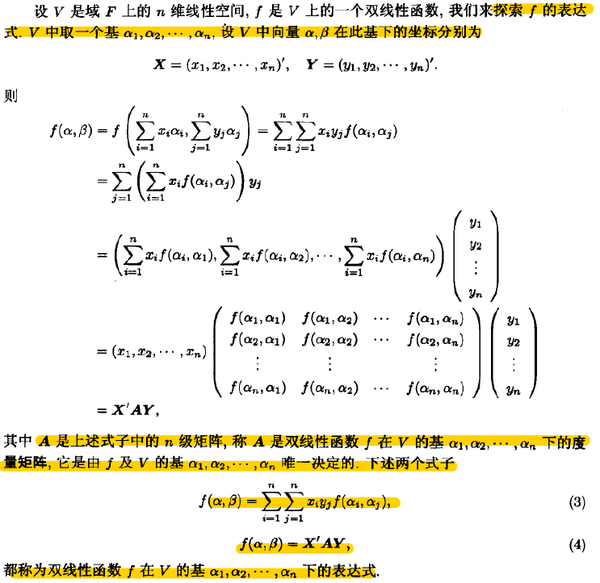
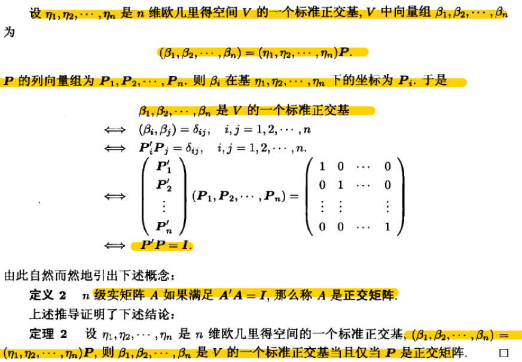

layout:     post                    # 使用的布局（不需要改）
title:      线性代数中的计算机问题               # 标题 
subtitle:   仰望星空，脚踏实地 #副标题
date:       2019-05-12              # 时间
author:     BY Seaside                     # 作者
header-img: img/memory/1.jpeg    #这篇文章标题背景图片
catalog: true                       # 是否归档
tags:                               #标签

    - CS

# 双线性函数

## 定义

### 度量矩阵

> 域F上n维线性空间V的一组基下，构造双线性函数对两个向量映射的表达式

### 不同基下度量矩阵的关系

> ==Proof：==
>
> 取$\alpha,\beta \in V$, 可知基偶下的坐标。
>
> $\alpha = (\alpha_1,..,\alpha_n)X = (\beta_1,..,\beta_n)\tilde X$  ,  $X=P\tilde X$
>
> $\beta = (\alpha_1,..,\alpha_n)Y = (\beta_1,..,\beta_n)\tilde Y$  ,   $Y=P\tilde Y$
>
> 分别两组基下计算f，
>
> $f(\alpha, \beta) = X’AY = \tilde X’B\tilde Y$
>
> 从而，可证。

- 矩阵合同， 矩阵秩

### 退化与非退化

- 左根 | 右根

- 退化

## 对称和斜对称双线性函数

设f是特征不为2的域F上n维线性空间V的一个对称线性函数，则V中存在一个基，使得f在此基下的度量矩阵为对角矩阵。

## 二次型 | 标准型

> 域F上一个n元二次齐次多项式称为F上的一个n元二次型。
> $$
> f(x_1,x_2,…,x_n)=\sum^n_{i=1}\sum^n_{j=1}a_{ij}x_ix_j = X'AX
> $$
> A为对称矩阵，称为二次型$f(x_1,x_2,…,x_n)$的矩阵
>
> 

域F的二次型$f(x_1,…,x_n) = X’AX$, 经过非退化线性替换，$X$用$CX$代入，变成二次型$g(x_1,…,x_n)=X’(C’AC)X$ , 矩阵是$C’AC$.

- 规范型

最简单的标准型

## 正定型

==定义==：n元实二次型$X’AX$ ，如果$\forall \alpha \in R^n , \alpha\neq 0$, 都有$\alpha’A\alpha > 0$, 则 $X’AX$是正定的。

==定义==：设A是n级实对称矩阵，如果二次型$X’AX$正定，则A正定实对称矩阵，也叫正定矩阵。

# 2. 内积空间

## 2.1 基本概念

### 内积

> $v^Tw = \sum v_jw_j$

定义：正定，对称，双线性函数。

度量：向量的长度，向量夹角

#### 性质

1.  （柯西不等式）实内积空间V，对任意向量$\alpha, \beta$有，$|(\alpha,\beta)| <=|\alpha||\beta|$ , 当且仅当线性相关。

2. （三角不等式）$|\alpha + \beta| <= |\alpha|+|\beta|$
3. （勾股定理）$|\alpha +\beta|^2 = |\alpha|^2+|\beta|^2$

### 距离

> 刻画极限的工具。

设E是一个非空集合，$d$是$E\times E$ 是$R$的一个映射，如果对$\forall x,y,z \in E$,

(1) $d(x,y)=d(y,x),  \text{(对称性)}$

(2)$d(x,y)>= 0,  \text{等号成立当且仅当$x=y$, (正定性)}$

(3)$d(x,z) <=d(x,y)+d(y,z), \text{(三角不等式)}$

那么称$d$是一个距离.如果集合E上定义了一个距离d，那么称E是一个度量空间。把$d(x,y)$称为x与y的距离。

## 2.2 标准正交基，正交矩阵

实内积空间V就是一个实线性空间连同V上指定的一个内积。

于是V就有了长度，角度，正交，距离等度量概念。

- 度量矩阵

- 欧几里得空间标准正交基的优点：

1. 计算向量内积
2. 求向量坐标

Fourier展开可看成向量在标准正交基下做投影分解。

- 求解n维欧几里得空间标准正交基

Schmidt正交化

### 正交矩阵

- 列向量表达

If $\{q_1,…,q_n\}$ are orthonormal, we get expansion coefficients via inner products:
$$
b =\sum_jx_jq_j \leftrightarrow x_j = q^T_jb
$$
矩阵表达
$$
Qx=b \leftrightarrow x=Q^Tb
$$

- 性质

1. A可逆，则$A^{-1}=A^T$, $Q^TQ=I$

2. $||Q x||=||x||$
3. 行列向量组皆为标准正交基

4. 实可逆矩阵A可唯一分解成，正交矩阵Q与主对角元素为正的上三角矩阵R。$A=QR$

---

- 最小二乘的解

Suppose A is $m\times n$. (m > n). A least-squares solution to $Ax = b$ is a vector x such that $||Ax − b|| = minimum$

==So, the residual $b − Ax$ is orthogonal to range(A).==

That is, for each column $a_j$ of A, $a^T (b − Ax) = 0$. Equivalently,

$A^T (b − Ax) = 0$. These are known as the ==normal equations==, ==$A^Tb = A^TAx$.==

> Matlab, x = A\b computes  least-squares solution if $m > n$

## 2.3 正交补,保距同构

实内积空间的子空间

- 正交投影

- 最小二乘

### 保距同构

## 2.4 正交变换

- 定义

性质：

1. 映射保持向量长度不变，两个非零向量夹角不变，正交性不变，距离不变。
2. 映射A是V上的一个线性变换。
3. A是单射，从而双射，所以可逆。

- 性质

## 2.5 对称变换

