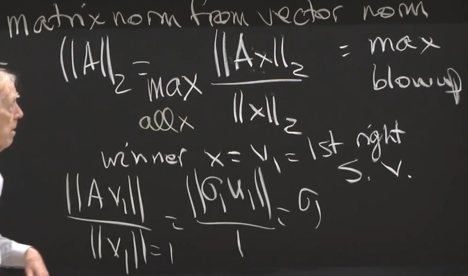

# 矩阵内积

$X,Y\in R^{m\times n}$

 $<X,Y>=tr(X^TY)=\sum_{i=1}^m\sum_{j=1}^nX_{ij}Y_{ij}$

> 两个矩阵的向量实际上就是将过矩阵的元素按照一定顺序（如按行)排列后所生成的$R^{mn}$中相应向量的内积

定义在$n\times n$对称矩阵集合$S^n$上的标准内积

$<X,Y>=tr(XY)=\sum_{i=1}^n\sum_{j=1}^nX_{ij}Y_{ij}=\sum_{i=1}^nX_{ii}Y_{ii}+2\sum_{i<j}X_{ij}Y_{ij}$

# 向量范数

另外，0<p<1时，范数图像为内凹的性质；当为0是，为x轴y轴直线，不包括0点。

## 直观感受

$$
\min\ ||x||\\
\text{subject to}\quad c_1x_1+c_2x_2=0
$$

对于1-范数，2-范数，得到的解不同。2-范数的解垂直直线，1-范数的解位于x=0的点。

也正好符号范数图像。

## 二次范数

Quadratic norms

$||x||_P = (x^TPx)^{1/2} = ||P^{1/2}x||_2$

> 其单位球为椭圆。

# 矩阵范数

## 向量范数诱导的矩阵范数 

> Defined in terms of the behaviour of a matrix as an operator between its ==normed domain and range spaces.==

### 例子

$$||A||_2=\sigma_1$$

> A的奇异值，也是$A^TA$的特征值。

- Frobenius范数

$||A||_F=\sqrt{\sigma_1^2+…+\sigma_n^2}$

> Frobenius范数实际上就是将矩阵的系数按照一定顺序排列后所生成的相应向量的Euclid范数。

$$||A||_{Nuclear}=\sigma_1+…+\sigma_n$$

### 直观感受

Example1: $A= \left[ \begin{matrix}1 & 2\\0 & 2\end{matrix} \right]$

Example2: 矩阵的1范数：$||A||_1 $ is equal to the “maximum column sum” of A.

### p-范数诱导的矩阵范数

## 非诱导的矩阵范数

> 对于酉矩阵Q，满足范数不变性： $||QA||_2=||A||_2,     ||QA||_F=||A||_F$ 

# 算子范数

# 对偶范数

# 谱与谱半径

向量/矩阵乘以正交矩阵，范数不变；

> $QA=QU\Sigma V^T$ , QU还是正交矩阵

