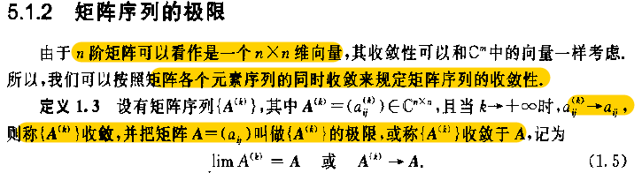
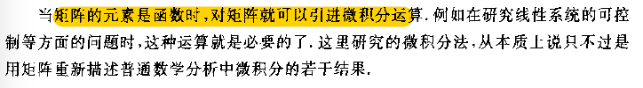
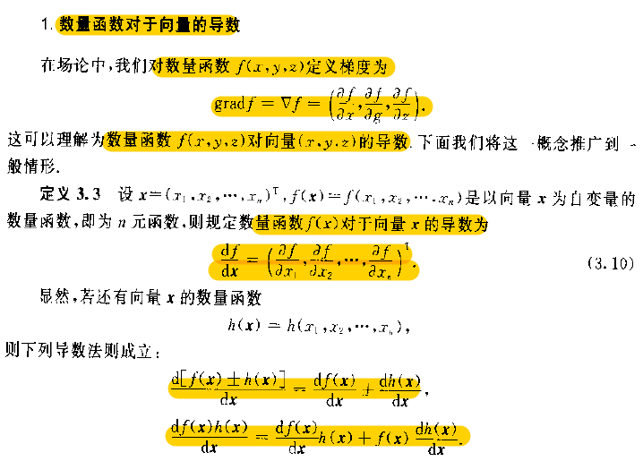

---

layout:     post                    # 使用的布局（不需要改）
title:      线性代数中的计算机问题               # 标题 
subtitle:   仰望星空，脚踏实地 #副标题
date:       2019-05-12              # 时间
author:     BY Seaside                     # 作者
header-img: img/memory/1.jpeg    #这篇文章标题背景图片
catalog: true                       # 是否归档
tags:                               #标签
    - CS
---

https://zhuanlan.zhihu.com/p/24709748

[https://github.com/soloice/Matrix_Derivatives/blob/master/matrix%20vector%20derivatives%20for%20machine%20learning.md](https://github.com/soloice/Matrix_Derivatives/blob/master/matrix vector derivatives for machine learning.md)

# 基础序列与极限

由范数概念之后，可以讨论向量序列和矩阵序列的极限，

矩阵级数，矩阵微分与积分等分析概念。

# 级数与函数

## 矩阵函数

- 特殊函数的解

方阵函数如同方阵多项式

### 性质

1. 若方阵**A** 与**B** 相似，即存在可逆矩阵**P**，使得$A = PBP^{-1}$ ,则有

$$
f(A) = Pf(B)P^{-1}
$$

2. 方阵为对角矩阵，则矩阵的函数等于对矩阵对角元素的函数。

### 计算

Jordan标准形法

最小多项式法

# 微分与积分

## 数量函数对向量导数

### 二次型Gradient

设$A=(a_{ij})_{n\times n}$ 为常量矩阵，$x=(x_1,x_2,…,x_n)^T$.  

二次型$x^TAx$

对于给定点的最大增长方向。最低点的梯度为0，得到最小$f(x)$.

### 常用公式

[Ref](https://atmos.uw.edu/~dennis/MatrixCalculus.pdf)

(1)$( N\times 1)$ Vector y, b $,   $ f(x)=bx$ ， $\nabla f(x) =b$  

 $y=f(x)=Ax$ ， $\nabla f(x) =A$

> 1. $f(x_i) = b_ix_i \to f(x_i)’ = b_i \to f(x)=b$
>
> 2. the ith element of y is given by  $y_i = \sum_{k=1}^{n} a_{ik}x_{k} $
>
>    so, $ \frac {\partial y_i}{\partial x_j} = a_{ij}$,  for all,   $ \frac {\partial y}{\partial x} = A$

(2) Scalar $\alpha$, $\alpha = y^TAx$, 

$\frac{\partial \alpha}{\partial x} = y^TA$  and $\frac{\partial \alpha}{\partial y} = x^TA^T$

> 设$w=y^TA$, 利用（1）代入可证

(3)Scalar $\alpha$,  $\alpha = f(x)=x^TAx$ ， $\nabla f(x) =(A+A^T)x = x^T(A+A^T)$

当A实对称时，二次型$x^TAx$ 对x导数为$2Ax$.

当$A=I$时，二次型 $f(x)=x_1^2+x_2^2+x_n^2$ 对x导数为$2x$.

> $\alpha = \sum_{j=1}^n\sum_{i=1}^na_{ij}x_ix_j$
>
> Differentiating with respect to the kth element of x we have:
>
> 对行列求导，由于只有k行，k列存在$x_k$,
>
> $\frac{\partial \alpha}{\partial x_k} = \sum_{j=1}^na_{kj}x_j+\sum_{i=1}^{n}a_{ik}x_i$
>
> for all,$ \frac{\partial \alpha}{\partial x} =  A^Tx+ Ax$

## 矩阵对于矩阵的导数

$$
if \space  x=(x_1,x_2,…,x_n)^T,   \text{then} \space \frac{dx^T}{dx} = I
$$

## 矩阵的全微分

## 矩阵函数的积分

 # 微分方程

# 梯度 

一阶 二阶

一阶近似 二阶近似

