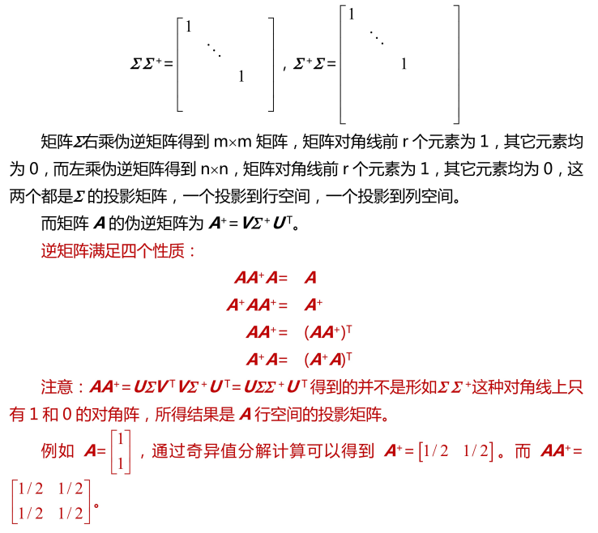

# 概念

满秩方秩才具有通常的逆。

## 左右逆

由满秩分解部分可知，
$$
F \text{列满秩} \Rightarrow F_L^{-1}=(F^HF)^{-1}F^H \\
G \text{行满秩} \Rightarrow G_R^{-1}=G^H(GG^H)^{-1} \\
$$

## 伪逆

### 理解

 

### 定义

对于任意一个矩阵$A\in C^{m\times n}$，若存在$G\in C^{m\times n}$，满足以下四个条件：

1. $AGA=A$
2. $GAG=G$
3. $(AG)^H=AG$
4. $(GA)^H=GA$

则，G为A的Moore-Penrose广义逆，M-P记为$A^+$;

> 这四个条件(性质)蕴含了一个事情：$AA^+$必然是一个效果等同单位矩阵I、但又不是单位矩阵I的矩阵。

伪逆矩阵更加常用的定义（基于SVD奇异值分解）：

- SVD公式：

$$
A=UΣV^∗
$$

- 伪逆矩阵公式：

$$
A^+=VΣ^+U^∗
$$

这个公式要注意的是中间的$Σ^+$的求法。因为$Σ_{m×n}$是一个对角线矩阵，但又不一定是方阵，所以计算它的伪逆矩阵的步骤是特殊又简单的：

1. 将对角线上的元素取倒数
2. 再将整个矩阵转置一次

### 求解广义逆

$$
A^+=G^+F^+=G^H(GG^H)^{-1}(F^HF)^{-1}F^{H}
$$

### 性质

- 当A可逆时，A的伪逆矩阵等于A的逆矩阵
- 零矩阵的伪逆矩阵是它的转置矩阵
- $(A^+)^+=A$
- $(A^+)^H=(A^H)^+$
- $A^H=A^HAA^+=A^+AA^H$ 
- $(αA)^+=α^{−1}A^+$，α不等于0
- $A^+=(A^HA)^+A^H=A^H(AA^H)^+$
- 若F列满秩，G行满秩，则有$(FG)^+=G^+F^+$
- U,V酉矩阵，则有$(UAV)^+=V^HA^+U^H$

- $rankA=rankA^+=rankA^+A=rankAA^+$
- $m-rank(I_m-AA^+)=n-rank(I_n-A^+A)=rankA$
- $(A^∗)^+=(A^+)^∗$

# 应用

## 线性方程组的解

若方程组$Ax=b$有解, 其通解
$$
x=A^+b+(I-A^+A)t \quad (\forall t\in C^n)
$$

> $A^+b$为特解，$b+(I-A^+A)t$ 为齐次解；

由$A=U\Sigma V^T$, 其中$\Sigma =[S\ 0]$, S为正定对角阵。
$$
A^+=A^T(AA^T)^{-1}=V\begin{bmatrix}   S^{-1} \\ 0\end{bmatrix} U^T
$$

## 最小二乘法

