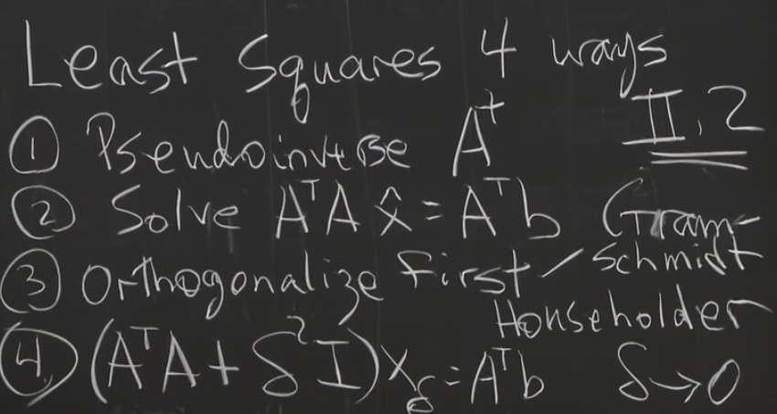
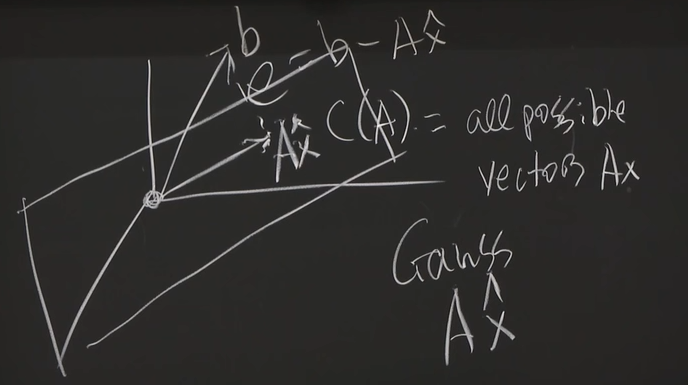
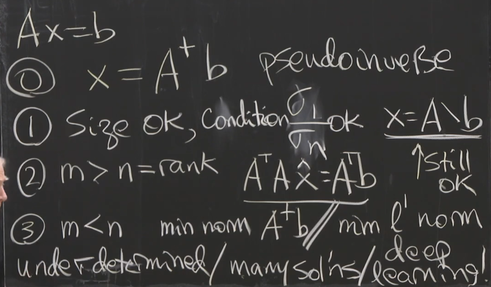
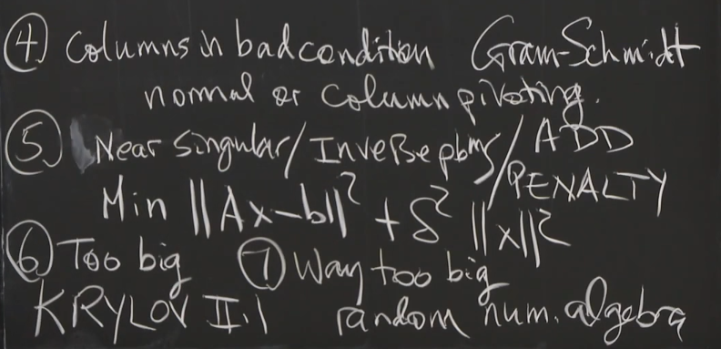
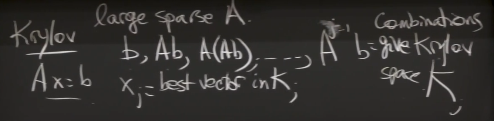

# 最小二乘问题

$$
Ax=b
$$

其中A不可逆，如何求解？

# 方法

## 1 伪逆法

由矩阵四个子空间图像可知

假定伪逆$A^+$, for x in row space
$$
A^+Ax=x\\
A^+(x_{r+1},...,x_n)^T=0
$$

### SVD

如果可逆，
$$
A^{-1}=V\Sigma^{-1}U^T
$$
如果不可逆，
$$
A^+=V\Sigma^+U^T 
$$
可猜，
$$
\Sigma^+\Sigma=
\begin{bmatrix} 1 & 0 & \cdots & 0\\
0 & 1 & \cdots &0\\
\vdots &0 & \cdots &0\\
0 &0 & \cdots &0\\
\end{bmatrix}
$$

$$
\Sigma^+=
\begin{bmatrix} \frac{1}{\sigma_1} & 0 & \cdots & 0\\
0 & \frac{1}{\sigma_2} & \cdots &0\\
\vdots &0 & \cdots &0\\
0 &0 & \cdots &0\\
\end{bmatrix}
$$

则最小二乘问题，可解得
$$
\bold x = A^+ \bold b
$$

## 2 投影法

对于最简单的一元线性回归问题，已知n组数据，$(x_i,b_i)$

假定其线性模型为$b_i = C+Dx_i$, 

矩阵形式则表达成
$$
A\begin{bmatrix}C\\D\end{bmatrix}=\begin{bmatrix}b1\\ \vdots\\b_n\end{bmatrix}
$$
其中，
$$
A=\begin{bmatrix}1&x_1\\ \vdots & \vdots \\1 & x_n\end{bmatrix}
$$
这个问题是不能精确求解的，怎么办？

### 高斯

利用高斯法，得到最优估计$\bold {\hat x}$。
$$
\min ||A\bold x-\bold b||_2^2=(A\bold x-\bold b)^T(A\bold x-\bold b)\\
=\bold x^TA^TA\bold x-2\bold b^TA\bold x + \bold b^T\bold b
$$
可知求解以下方程可得最优，
$$
A^TA\bold {\hat x}=A^T\bold b
$$

### 几何图像

$\bold b$不在列空间, 利用投影，得到解$\bold {\hat x}$

### 与伪逆联系

当A是independent cols， 则$A^TA$可逆， Null(A)=0,r=n,

可知，
$$
A^+\bold b=(A^TA)^{-1}A^T\bold b \Rightarrow
$$

$$
V\Sigma^+U^T=(A^TA)^{-1}A^T
$$

Notice,
$$
(A^TA)^{-1}A^TA=I
$$

---

 # 困难点

 

## 4 列向量靠近彼此

当$a_2$方向靠近$a_1$时，在使用斯密特QR正交方法时，第二个正交项$||A_2||$会很小，$a2=\frac{A_2}{||A_2||}$ 。

- 解决法

同时计算所有其他列与第一列的正交项，选择最大的一列。依次类推。

## 5 奇异值接近0

SVD方法，则$A^+=V\Sigma^+U^T$ 中的$\frac{1}{\sigma}$ 就会变得很大。

利用惩罚项，则会增加奇异值，
$$
\min ||A\bold x-\bold b||^2_2+\delta^2||\bold x||^2_2
\tag{3-5-1}
$$
问题就变成了如下

矩阵形式，
$$
\begin{bmatrix} A\\ \delta I\end{bmatrix}
\begin{bmatrix} \bold x\end{bmatrix}=
\begin{bmatrix} \bold b\\0 \end{bmatrix}
$$
则等价于
$$
A^*\bold x=\bold {b^*}
$$

$$
(A^TA+\delta^2I)\bold x=A^T\bold b
\tag{2-5}
$$

- 例子

对于1x1情况，令$A=[\sigma]$,
$$
\bold x=\frac{\sigma}{\sigma^2+\delta^2}\bold b
\tag{3-5-3}
$$
if $\delta=0$, 

$\sigma>0, x=\frac{1}{\sigma}$,

$\sigma=0, x = 0$

令外，For any A
$$
(A^TA+\delta^2I)^{-1}A^T \to A^+
$$
不妨看看
$$
(\Sigma^T\Sigma+\delta^2I)^{-1}\Sigma^T \to \Sigma^+
$$
对角每一项，和3-5-3 一致。

## 6 大稀疏矩阵

和斯密斯正交化相似，

思想：

如果$x=c_1q_1+…+c_nq_n$, 可知$q_1^Tx=c_1q_1^Tq_1+…+c_nq_1^Tq_n=c_1q_1^Tq_1=c_1$

同时$c=Q^Tx$，可见正好一致。

> 详见《数值线性代数》

## 7 超大矩阵

概率

mean

variance

拉格朗日乘子

- 例子

[a,b]

选取概率$P_i=1/2,1/2$

2 Sample: $[a,0],[b,0]$

Mean = [a/2,b/2]

$\sigma^2=1/2[]$