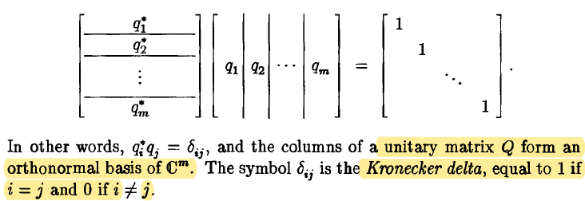
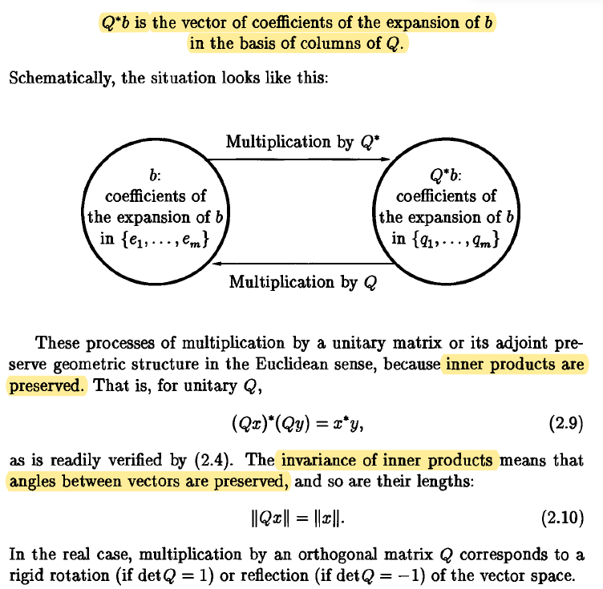
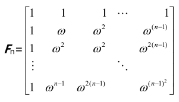
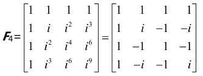
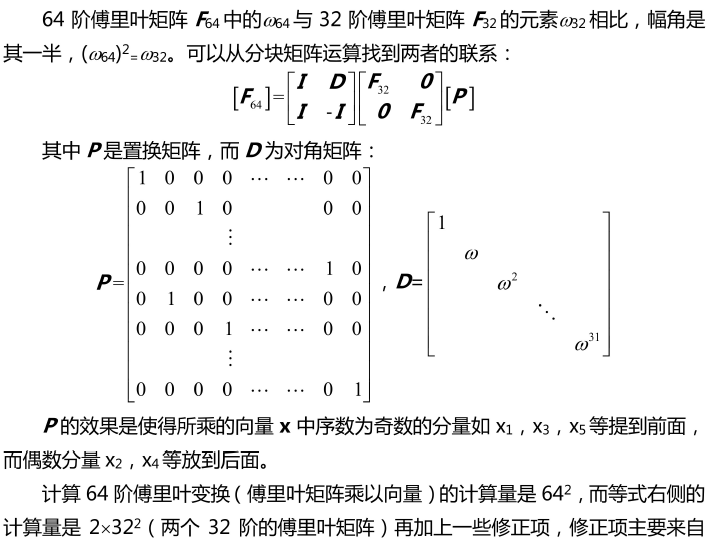
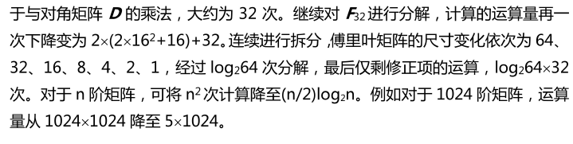

# 复内积空间

## Hermite

- Hermite性

根据Herimite性和第一个向量是线性的，

$(\alpha, k_1\beta_1 + k_2\beta_2) = \bar k_1(\alpha,\beta_1)  + \bar k_2(\alpha,\beta_2)$,

对第二个变量是半线性的。

- Hermitian矩阵

两种记号表示相同。$A^* =  A^H$

 $A = A^H = \bar {A^T}$  

> 具有实数特征值和正交的特征向量

## 定义

内积
$$
(x,y) = y^Hx = \sum_{i=1}^n\bar x_iy_i
$$
长度 
$$
||x|| = \sqrt {x^Hx} = (\sum_{i=1}^m|x_i|^2)^{1/2}
$$
夹角
$$
cos\alpha = \frac{x^*y}{||x||\cdot ||y||}  
$$

## 结构

### 标准正交基

### 酉矩阵(Unitary Matrix)

- 正交补

- 酉矩阵

> 复空间下的正交矩阵. $Q^*Q = I$ 

- 向量乘法

实空间：$ Ax$ and $A^{-1}b$

复空间：$ Qx$ and $Q^*b$

### 同构

# Fourier矩阵

- Fourier级数

$$
f(x)= a_0+a_1cosx+b1sinx+a_2cos2x+b_2sin2x+…
$$

> 在无限维空间下，向量在标准正交基的分解。

- Fourier变换

（连续）傅里叶变换将可积函数表示成复指数函数的积分或级数形。

- Fourier矩阵

$(F_n)_{jk}=\omega^{jk}$,  而 $\omega^n=1, \space \omega = e^{\frac{i2\pi}{n}}$

> 矩阵列向量正交。
>
> $\omega$ 分布在复平面的单位元，只是幅角不同。

当n等于4时，$w=i$, 也就是90度。

> $F_4$得到一个四点离散的Fourier变换，逆矩阵就是反Fourier变换。
>
> 矩阵可以分解成一系列稀疏矩阵。
>
> $F_4, F^{-1}_4$ 为正交矩阵
>
> 向量标准正交$\frac {1}{4} F_4^HF_4 =I$ , 逆矩阵就是共轭转置。

### FFT

